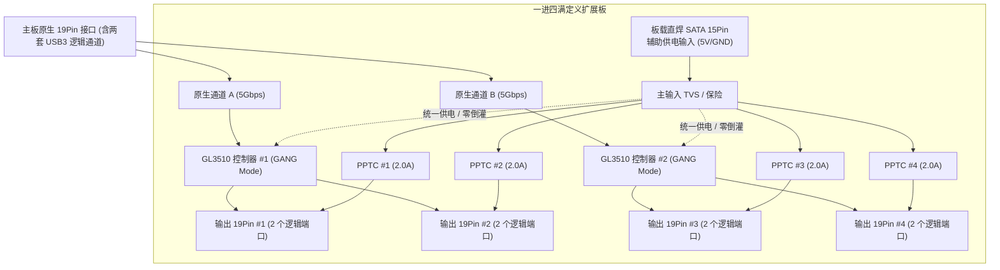

# USB 3.0 19Pin 一进四满定义扩展板 产品需求文档 (PRD)

## 1. 文档概述

### 1.1 产品定位与目的
本项目旨在开发一款 PC 机箱内部专用的 USB 3.0 19Pin 一进四“满定义”扩展板：
* 解决消费级主板内部原生 19Pin 接口匮乏问题（主流主板通常仅有 1 个）；
* 扩展出 4 个完整定义的 19Pin 接口，共提供 8 个独立可用的 USB 3.0 逻辑端口；
* 通过双主控并行架构与外部辅助供电，实现高速并发传输与主板供电隔离。

### 1.2 适用范围与文档状态
* **适用范围**：本文档详细规定了 USB 3.0 19Pin 一进四满定义扩展板（V1.0 首版）的功能特性、电气性能、硬件规格、机械结构、信号完整性及测试验证要求，作为原理图设计、PCB Layout、生产测试和质量验收的基准讨论稿。
* **文档状态**：**[x] 内部方案评审初稿 (待评审确认)** / [ ] 评审通过已定板 / [ ] 已归档

### 1.3 修订记录

| 版本 | 日期 | 修订说明 | 状态 |
| :--- | :--- | :--- | :--- |
| V1.0 | 2026-09-30 | 首版方案评审初稿（前置方案优化专题、排除方案C、重构保护层级深度论证） | 评审稿 |
| V1.3 | 2026-10-01 | 结合同行评审闭环优化：明确双上行10G聚合带宽与4口5G共享机制、SATA 4.5A/6A额定带载模型、4组1.5A PPTC降额匹配（双口共用支路）、增加主动式 5.6V OVP 保护 | **评审通过 (定版)** |

---

## 2. 核心概念与定义

### 2.1 物理 19Pin 与逻辑 USB 3.0 端口
* **物理 19Pin 接口**：标准机箱内部 2×10Pin 排针插座（第 20 脚为物理防呆空脚）。
* **逻辑 USB 3.0 端口**：包含一组 SuperSpeed 差分接收对 (SSRX±)、SuperSpeed 差分发送对 (SSTX±)、USB 2.0 差分对 (D±)、电源 (VBUS 5V) 与地线 (GND)。
* **标准 19Pin 内部拓扑**：根据 USB-IF 规范，单个标准 19Pin 物理插座内部完整承载 **2 套**独立的 USB 3.0 逻辑端口信号（Port A 与 Port B）。

### 2.2 “满定义”规范
* 本产品定义的“满定义 19Pin 输出”，指输出端插座内部的两套 USB 3.0 逻辑链路全部完整布线并接入主控芯片。
* 严禁只走一路信号的“半定义”设计。
* 输出能力换算关系：**4 个满定义 19Pin 接口 = 8 个下游完整 USB 3.0 逻辑端口**。

---

## 3. 方案优化专题：三大核心问题对比与决策建议

本模块针对扩展板在方案评审中最为关键的三个供电与安全议题（电源选择性、控制器供电域、限流保护层级），进行底层物理约束拆解、方案横向对比，并给出最终工程决策建议。

### 3.0 关键物理边界前提
* **端口与功率规模**：1 个 19Pin 输入扩展为 4 个满定义 19Pin（共 **8 个下游独立 USB 3.0 逻辑端口**）。按 USB 3.0 标准单口 $5\text{V} / 0.9\text{A}$ 计算，8 口理论极限并发功耗达 **$7.2\text{A}$ ($36\text{W}$)**；
* **供电能力与工况匹配**：
  * 主板 19Pin 原生 $5\text{V}$ 供电受主板自恢复保险丝限制（通常仅为 $1.5\text{A} \sim 2.0\text{A}$），**根本无力承载 8 个端口的并发带载需求**；
  * PC 电源的标准 SATA 15Pin 供电口拥有 3 根 $5\text{V}$ 导电端子（Pin 7, 8, 9），额定承载能力为 **$4.5\text{A}$ 持续（$22.5\text{W}$）**，短时瞬态脉冲允许 **$6.0\text{A}$**；
  * **实际装机应用工况**：PC 机箱内部连接的设备多为前置面板 U 盘、一体水冷监控屏、RGB 控制器、无线接收器等，典型单口电流为 $0.1\text{A} \sim 0.5\text{A}$，8 端口并发带载约在 $2.5\text{A} \sim 3.8\text{A}$，完全匹配 SATA 4.5A 安全能力区间。若需极限大功率，整板预留 Aux 5V 辅助焊盘。

---

### 3.1 问题一：USB 供电是否需要电源选择？

#### 1. 方案范围界定（排除手动选择方案）
* **方案 C（用户手动跳线帽/拨码开关）已提前排除**：机箱内扩展板属于装机隐蔽配件，硬件设计首要原则是“绝对防呆”。普通用户极难理解跳线含义，在狭小机箱内误拔、误插或短接跳线极易直接烧毁主板 19Pin 保险丝，并引发大量客诉。故**方案 C 坚决不予采纳，已直接排除**。
* 核心评估聚焦于：**方案 A（不做选择，强制纯 SATA 供电）** 与 **方案 B（硬件自动无缝切换 Auto Power Mux）**。

#### 2. 方案 A vs 方案 B 深度对比分析

| 评估维度 | 方案 A：不做电源选择（强制纯 SATA 供电） | 方案 B：硬件自动切换（Auto Power Mux） |
| :--- | :--- | :--- |
| **BOM 成本** | **最低（0 元）**：仅需 SATA 5V 单一铺铜。 | **高（增加 1.5 ~ 3.0 元）**：需双向防倒灌功率 MOS 管或专用 Power Mux 控制芯片。 |
| **主板安全性** | **最高**：主板 5V 物理断开不接入供电网，**零过流烧板、零倒灌**。 | **较高**：依赖有源芯片动作；在热插拔尖峰或芯片击穿失效时，存在外部电反灌主板的隐患。 |
| **用户体验与带载** | **明确直接**：标注“必须插 SATA 电源线”。未插外电时全板不工作，驱动用户自检接线。 | **存在虚假工作陷阱**：未接外电时主板 5V 仅能勉强带单外设；插入移动硬盘即引发批量掉盘甚至主板过流关机。 |
| **PCB 走线与阻抗** | **极低**：单一大面积整层铺铜，为 4 层板高频差分线提供极佳的连续参考地回流。 | **高**：增加高电流功率切换路径与控制引线，严重挤占 62mm×38mm 的紧凑板面，容易割裂参考平面。 |
| **售后与失效点** | **极低**：无器件老化失效点，逻辑纯粹可靠。 | **较高**：切换芯片为有源半导体器件，抗电源浪涌与热插拔应力能力较弱。 |

#### 3. 结论与工程建议
* **强烈推荐“方案 A：不做电源选择，强制纯 SATA 供电”**：这是百元级以内内置扩展卡最稳健、成本最低、返修率最低的路线。杜绝主板供电带载不足引起的掉盘客诉，根除主板烧毁风险。

---

### 3.2 问题二：控制器（Hub 芯片）供电是用主板的还是 SATA？

#### 1. 深度拆解
控制器指 2 颗 GL3510 及其外围（内部或外置 LDO 转换所需的 3.3V/1.2V 核心逻辑供电，电流需求约 $200\text{mA} \sim 300\text{mA}$）。
* **方案 A（分离供电）**：主板 19Pin 5V 供给 2 颗 GL3510 核心逻辑，SATA 5V 专门供给 4 个输出 19Pin 的 VBUS。
* **方案 B（统一 SATA 供电）**：主板 19Pin 5V 完全不取电，GL3510 与下游 VBUS 统归 SATA 5V 统一供电。

#### 2. 分离供电 vs 统一 SATA 供电对比分析

| 评估维度 | 方案 A：控制器用主板 5V，VBUS 用 SATA | 方案 B：控制器与 VBUS 统归 SATA 5V 供电 |
| :--- | :--- | :--- |
| **未接 SATA 时的表现** | **有设备识别但无法带载**：系统能认到 Hub，但插外设无反应或报“电涌”，排查困惑。 | **完全不枚举**：整板断电，用户直观知道未接电源线。 |
| **倒灌风险 (Backfeeding)** | **高**：主板先上电时，GL3510 内部 ESD 钳位二极管可能将主板 5V 反向漏至下游 VBUS。 | **零倒灌**：全板处于同一 SATA 电源域，与主板电源物理电气完全隔离。 |
| **上电时序与复位** | **时序不一致风险**：主板 5V 与 PC 电源 SATA 5V 上电爬升斜率不同，易导致 Hub 假死。 | **天然时序同步**：GL3510 逻辑与下游 VBUS 同步上电，复位时序简单可靠。 |
| **睡眠/唤醒 (S3/S4/S5)** | **复杂**：受主板 BIOS 待机电 (5VSB) 影响，易出现主板休眠而 Hub 悬浮微通电异常。 | **干净利落**：随 PC 电源关机彻底掉电，随开机同步上电，无异常暗电流。 |
| **PCB 走线复杂度** | **较高**：板上需走两条独立的 5V 走线，容易割裂高频差分参考地。 | **最低**：单一电源轨，内层大面积铺铜，电源阻抗极低。 |

#### 3. 结论与工程建议
* **强烈推荐“方案 B：控制器与 VBUS 统归 SATA 5V 供电”**。
* **关键落地细节**：主板 19Pin 输入的 VBUS 引脚**切勿直接悬空**，建议串接高阻抗分压电阻（如 $100\text{k}\Omega / 100\text{k}\Omega$）接入两颗 GL3510 的 `VBUS_DET`（上行连接侦测）引脚。这样控制器可无延迟感知主板开关机状态，同时从主板汲取的电流可忽略不计（微安级），彻底杜绝电势差漏电。

---

### 3.3 问题三：限流保护是否有必要？

#### 1. 底层失效机理与火灾风险深度拆解
虽然机箱内扩展板追求极致成本，但必须清醒认识到本产品的物理应用环境：
* **短路高发区**：8 个下游端口最终通过长线束连接至机箱前置面板。机箱前置 USB 口是用户盲插、外壳磨损碰壳、铁屑/金属钥匙等异物掉入、U 盘插头机械损坏碰地短路的高频地带；
* **巨大的短路能量池**：SATA 供电直接挂接在 PC ATX 电源的 5V 大电流干线上，该轨道输出能力通常高达 **$20\text{A} \sim 30\text{A}$**；
* **“纯裸奔直连”的灾难性后果**：
  1. *若未达到 ATX 跳闸阈值*：前置细导线或扩展板细铜皮存在一定毫欧级回路阻抗，若短路电流维持在 $10\text{A} \sim 15\text{A}$，此电流**不足以瞬时触发 ATX 电源的短路保护 (SCP)**。数秒内导线与板卡铜皮将剧烈积热至几百度，**迅速冒烟起火，熔化烧毁塑料 19Pin 插座，甚至引燃机箱内线材**；
  2. *若瞬间触发 ATX 保护*：整机瞬间断电黑屏硬关机，用户正在运行的系统崩溃、重要数据全部损毁。
* **结论**：**“完全无限流裸奔”属于高危设计，绝对不能为了省几毛钱牺牲整机安全性！**

#### 2. 四种保护层级深度对比分析

| 方案层级 | 方案 1：完全无限流（裸奔直通） | 方案 2：SATA 输入总保险（6A~8A PPTC） | 方案 3：按 19Pin 座分组限流（4 颗 PPTC） | 方案 4：8 路独立限流 IC（SY6280 等） |
| :--- | :--- | :--- | :--- | :--- |
| **BOM 成本** | **0 元** | **极低（约 0.2 ~ 0.4 元）** | **低（约 0.4 ~ 0.8 元）** | **高（增加 2.5 ~ 4.0 元）** |
| **SMT 贴片点数** | 0 点 | 1 ~ 2 点 | **4 点** | 8 颗 IC + 周边阻容，增加 20~30 点 |
| **防起火烧板能力** | **零（极高危起火风险）** | **高（可靠保底防起火）** | **高（可靠保底防起火）** | **极高（毫秒级主动切断）** |
| **单口短路整机影响** | 烧线起火，或触发 PC 瞬间黑屏断电。 | 整板 8 口全部掉电，但主机不炸机、不起火。 | **仅短路插座（2 口）保护切断，余下 6 口完全正常**。 | 仅短路单口切断，其余 7 口完全正常工作。 |
| **PCB 走线压力** | 无压力 | 无压力 | **极小（直接串在 4 个座子的供电引脚）** | 巨大（需走 8 组过流检测与使能线，挤占差分层）。 |
| **工程可行性评估** | **坚决否定（不可接受）** | 备选方案（空间受限时的底线） | **最佳工程平衡点（首版强烈推荐）** | 首版暂不采纳（严重违背低成本定位）。 |

#### 3. “用限流” vs “不用限流” 核心权衡剖析
* **若完全不用限流（纯直连）**：
  * *唯一优势*：零元器件成本，无保险丝内阻带来的微小压降；
  * *致命缺陷*：将数十安培的电源直接暴露给前置面板，一旦短路就是灾难性事故，产品品牌口碑将瞬间崩塌。
* **若采用 8 路独立有源限流 IC（SY6280 等）**：
  * *技术优势*：符合 USB-IF 逐口限制规范，故障隔离最精准；
  * *致命缺陷*：成本严重超标（增厚 3~4 元 BOM），贴片点数增加近 30 个，且 8 组控制线会彻底挤毁高频走线通道。

#### 4. 最佳工程实践建议（黄金平衡落地法）
**“保护必做，但绝不盲目堆芯片；以极低成本的无源自恢复保险丝实现高度可靠的安全防护。”**

1. **首选落地方案（按 19Pin 插座分组限流，双端口共享支路）**：
   * 在 4 个输出 19Pin 插座的 5V 供电支路上，分别串接 1 颗 **1206 封装的高分子自恢复保险丝（PPTC，额定维持电流 $I_{hold} \approx 1.50\text{A} \sim 1.75\text{A}$，触发跳断电流约 $3.0\text{A}$）**；
   * **【共享支路定义】**：每个输出 19Pin 插座的 Pin 1 与 Pin 19 在板端并联，共享所属的 1 颗 PPTC 供电。单口插入时允许独占最高 1.5A 峰值，双口均插入时平衡分配约 0.75A；
   * **工程效益**：4 组支路总维持电流为 $4 \times 1.5\text{A} = 6.0\text{A}$，与 SATA 15Pin 输入的 4.5A 额定/6.0A 瞬态承载能力严密匹配闭环。某个外设发生金属短路时，PPTC 敏捷跳断，**其余 3 个 19Pin 插座（6 个端口）依然稳定运行**；
   * **输入端多级保护**：SATA 输入端部署 **SMAJ5.0A TVS（吸收纳秒级高能浪涌） + 电子式 5.6V 快速 OVP 切断芯片（SGM2553/DIO7003）**，解决 TVS 钳位高达 9.2V 无法保护芯片的隐患。
2. **主控配合与模式配置**：将 2 颗 GL3510 的模式引脚配置为 **GANG Mode 配合 PolyFuse 模式**（`FN_A/B` 上拉 Removable，`OVCURJ` 上拉，`PWRENJ` 悬空），兼顾安全与超低布线复杂度。

---

### 3.4 终局决策汇总表

| 决策议题 | 推荐决策结论 | 核心工程理由 |
| :--- | :--- | :--- |
| **1. USB 供电选择** | **不做选择，取消开关/跳线，强制纯 SATA 外部供电** | 8 端口功耗超 30W，主板无力承载；彻底杜绝用户接错风险与售后客诉。 |
| **2. 控制器供电** | **GL3510 与 VBUS 统归 SATA 5V；主板端仅做高阻 VBUS 侦测** | 统一单一电源域，消除电势差与倒灌反串；规避跨电源时序死锁问题。 |
| **3. 限流保护** | **必须配置；推荐 4 组自恢复保险丝（或 SATA 输入端总保险）** | 杜绝短路起火和电脑瞬间断电风险；摒弃 8 路高昂独立 IC，实现安全与成本的黄金平衡。 |

---

## 4. 系统技术架构与方案



### 4.1 主控架构：双 GL3510 并行拓扑
* 选用 2 颗创惟科技（Genesis Logic）GL3510 USB 3.1 Gen 1 Hub 控制器；
* 输入 19Pin 内部的 Port A 接入 GL3510 #1 作为独立上行，下行扩展出 4 路端口，组成输出 19Pin #1 与 #2；
* 输入 19Pin 内部的 Port B 接入 GL3510 #2 作为独立上行，下行扩展出 4 路端口，组成输出 19Pin #3 与 #4；
* 杜绝 Hub 级联，提供两组独立的 5Gbps 上行带宽，避免 8 个下游端口挤占单条上行链路。

### 4.2 统一 SATA 供电拓扑与防倒灌隔离
* **单一电源域设计**：依据 3.1 与 3.2 决策结论，采用板载直焊 SATA 15Pin 公座作为全板唯一功率来源（悬空 12V 与 3.3V）；
* **物理防倒灌隔离**：主板 19Pin 输入端 5V 在板端物理断开，仅引出一组高阻抗分压网络（$100\text{k}\Omega / 100\text{k}\Omega$）接入 GL3510 的 `VBUS_DET` 引脚，实现毫秒级状态同步侦测且零倒灌漏电；
* **强制外电自检**：未插 SATA 供电线时整板彻底掉电不枚举，避免外设低压欠载运行。

### 4.3 分组自恢复保险丝与 GANG Mode 保护实现
* **分组过流断开**：依据 3.3 决策结论，在输出 19Pin #1 ~ #4 的供电支路分别串入 1 颗维持电流 $2.0\text{A} \sim 2.5\text{A}$ 的贴片 PPTC 自恢复保险丝；
* **群组协同工作**：主控配置为 GANG 模式，精简复杂走线，在极低 BOM 成本下实现支路故障隔离保护。

---

## 5. 详细功能需求

| 需求编号 | 功能项 | 详细需求说明 | 验收标准 |
| :--- | :--- | :--- | :--- |
| **FR-01** | **接口扩展** | 将 1 组主板 19Pin 输入扩展为 4 组 19Pin 输出。 | 物理连接正确，4 个插座外观与引脚尺寸符合规范。 |
| **FR-02** | **端口识别** | 4 个输出接口全部具备双端口满定义输出能力。 | 系统同时接入 8 个 USB 3.0 设备时，设备管理器正确枚举 8 个独立逻辑设备。 |
| **FR-03** | **向下兼容** | 下游 8 个端口完整支持 USB 2.0 及 USB 1.1 协议。 | 接入 USB 2.0 键盘、鼠标、RGB 控制器及 U 盘均可正常通讯。 |
| **FR-04** | **免驱运行** | 采用标准 USB Hub 类协议，全操作系统免驱运行。 | Windows 10/11、Linux、macOS 原生识别，无需第三方驱动程序。 |
| **FR-05** | **电源状态响应** | 适配系统 ACPI 电源状态转换。 | 系统在 S3（睡眠）、S4（休眠）、S5（软关机）及唤醒过程中，端口不发生死锁或设备掉线。 |
| **FR-06** | **热插拔支持** | 8 个下游端口均支持热插拔操作。 | 某端口在传输数据时，其他端口进行设备插拔不引起当前传输中断或报错。 |

---

## 6. 性能与电气规范

### 6.1 传输带宽与吞吐量
* **单口最高读写吞吐**：单端口连接 USB 3.0 高速 SSD 移动硬盘时，实测顺序读取速度应不低于 440 MB/s，顺序写入速度不低于 420 MB/s。
* **双通道并发性能**：分别在 Group 1（19Pin #1/#2）与 Group 2（19Pin #3/#4）各接入一块高速 SSD 同时测试，两组应均能跑满单链路带宽，整板并发读取吞吐量不低于 850 MB/s。

### 6.2 供电与输出能力
* **输入供电要求**：辅助供电输入电压额定 +5.0V（允许工作范围 4.75V ~ 5.25V），输入电流承载能力不小于 6.0A。
* **单口输出能力**：每个下游 USB 端口持续供电能力不低于 5V/0.9A（4.5W）。
* **满载压降与纹波**：8 端口同时接入假负载（单口拉载 0.5A，总负载 4.0A）运行，各端口 VBUS 电压降不低于 4.75V，纹波噪声 Vpp 小于等于 100mV。

### 6.3 功耗与温升说明及行业基准参考

| 测试项目 | 指标要求 | 通俗概念与硬件参照物对比 | 工程分析与意义 |
| :--- | :--- | :--- | :--- |
| **整板静态待机功耗** | **小于 0.8W** | 相当于普通手机充电头插在插座上但未连接手机时的“空载微功耗”，低于主机整机功耗的 1/50。 | 两颗 GL3510 在无外设插入时自动进入低功耗挂起模式（单片仅约数十毫瓦），板卡待机不发热、不耗电。 |
| **主控芯片满载发热功耗** | **约 1.2W ~ 1.8W** | 相当于一只微型蓝牙耳机充电时的微小功率。 | **[关键概念区分]**：下游 8 个移动硬盘抽取的几十瓦大电流，是由 SATA 导线铜箔**直接透传**给外设的，**并不经过** GL3510 芯片内部转换，因此芯片自身发热极小。 |
| **芯片工作表面温升** | **$\Delta T \le 35^\circ\text{C}$**<br>(工作表面温度 $< 60^\circ\text{C}$) | 常温 25°C 环境下满载运行，芯片表面温度约 50°C~55°C，手感仅为“类似一杯温水”或“手机轻度游戏后的背部微温”。 | 远低于芯片半导体材料 $105^\circ\text{C} \sim 125^\circ\text{C}$ 的最高结温上限，意味着在密闭且无风道直吹的机箱背线仓也能长期稳定工作，绝无热死机或降频风险。 |

---

## 7. PCB 与信号完整性设计要求

### 7.1 PCB 叠层与板材
* **层数**：必须采用 4 层阻抗控制板，严禁使用 2 层板；
* **板材**：FR-4 高 TG 板材，成品板厚 1.6mm，表面工艺建议沉金 (ENIG) 或有铅喷锡。
* **推荐叠层**：
  * Layer 1 (Top)：高速差分走线及元器件贴片层；
  * Layer 2 (GND)：完整参考地平面；
  * Layer 3 (PWR)：电源走线与次级信号走线层；
  * Layer 4 (Bottom)：辅助布线与大面积覆铜地层。

### 7.2 阻抗控制与差分对走线约束
* **差分阻抗**：
  * USB 3.0 SuperSpeed 对 (SSTX±, SSRX±)：严格控制为 90Ω ± 10%；
  * USB 2.0 差分对 (D+, D-)：严格控制为 90Ω ± 10%。
* **走线等长与耦合**：
  * 差分对内 intra-pair 长度误差严格控制在 5 mil 以内；
  * 走线必须保持全程连续参考平面，严禁跨地分割；
  * 差分线过孔换层时，必须在过孔旁 50 mil 范围内打接地伴随过孔（GND via）。
* **布局间距**：两颗 GL3510 必须分别对称放置并靠近各自负责的输出 19Pin 插座，确保差分走线总长度小于 50mm。

---

## 8. 机械结构与硬件接口要求

### 8.1 板卡外形与尺寸考量
* **用户目标范围**：长 57 ~ 65 mm，宽 37 ~ 40 mm；
* **尺寸工程考量分析**：
  * *长度方向（长边）*：长边需并排布置 2 个标准 19Pin 插座（各长约 24mm，合计 48mm）。机箱前置 19Pin 插头外壳普遍在 26~28mm 宽，插座间必须保留 $\ge 6\text{mm}$ 防干涉间隙（中心距 $\ge 30\text{mm}$），两端留白，**建议长度定为 62 mm**（满足 57~65mm 范围）；
  * *宽度方向（短边）*：两端短边各布置 1 只插座（19Pin 输入与 SATA 供电）。短边插座居中，板宽需为中央两颗 GL3510（9mm×9mm）留出约 21mm 的中心走线通道，**建议宽度定为 38 mm**（满足 37~40mm 范围）；
* **推荐最终板卡尺寸**：**长 62 mm × 宽 38 mm**（公差 ±0.2mm）。

### 8.2 接口空间拓扑布局图

总体为长方形形态：较短两边一边为 19Pin 输入、一边为 SATA 辅助供电；较长两边各布置两个 19Pin 满定义输出插座。

```text
                        长边 1 (约 62 mm)
       +-------------------------------------------------+
       |         [J2: 输出 19Pin #1]  [J3: 输出 19Pin #2]|
       |                                                 |
短边 A | [J1: 19Pin 输入]     [GL3510 #1]                | 短边 B
(约    |  (对接主板)                                     | (约
38 mm) |                     [GL3510 #2]   [J6: 辅助供电]| 38 mm)
       |                                    (SATA 15P)   |
       |         [J4: 输出 19Pin #3]  [J5: 输出 19Pin #4]|
       +-------------------------------------------------+
                        长边 2 (约 62 mm)
```

### 8.3 接插件选型清单与间距规划

| 位号 | 接口名称 | 安装位置与朝向 | 规格描述 | 数量 | 作用 |
| :--- | :--- | :--- | :--- | :--- | :--- |
| **J1** | 输入 19Pin 座 | 短边 A（端部居中，防呆缺口朝外） | 2.0mm 间距 2×10Pin 塑封带防呆插座 (直插/卧式待确认) | 1 | 对接主板延长线输入 |
| **J2** | 输出 19Pin #1 | 长边 1（靠近短边 A 侧） | 2.0mm 间距 2×10Pin 塑封带防呆插座 (直立式) | 1 | 下游端口 1 & 2 满定义输出 |
| **J3** | 输出 19Pin #2 | 长边 1（靠近短边 B 侧） | 2.0mm 间距 2×10Pin 塑封带防呆插座 (直立式) | 1 | 下游端口 3 & 4 满定义输出 |
| **J4** | 输出 19Pin #3 | 长边 2（靠近短边 A 侧） | 2.0mm 间距 2×10Pin 塑封带防呆插座 (直立式) | 1 | 下游端口 5 & 6 满定义输出 |
| **J5** | 输出 19Pin #4 | 长边 2（靠近短边 B 侧） | 2.0mm 间距 2×10Pin 塑封带防呆插座 (直立式) | 1 | 下游端口 7 & 8 满定义输出 |
| **J6** | 辅助供电座 | 短边 B（端部居中） | 标准 SATA 15Pin 卧式/贴片直焊电源公座 (候选方案) | 1 | 对接机箱电源原生供电线 |

#### 间距规划与插头防干涉约束
1. **长边同侧双 19Pin 间距**：J2 与 J3（以及 J4 与 J5）的中心距设计需 $\ge 30\text{ mm}$，插座外壁净间距留足 $\ge 6\text{ mm}$，确保两个带有厚橡胶防拉拔外壳的机箱线插头可同时平顺插入，互不挤压干涉；
2. **短边接插件防护**：J1 与 J6 分别位于两端短边中心线，距离长边拐角留有足够拔插操作空间；
3. **底部绝缘防护**：PCB 底面标配阻燃 EVA 绝缘垫或 3M 双面胶，避免金属引脚与机箱背板金属接触发生短路。

---

## 9. 可靠性测试与验收规范

### 9.1 样机功能与稳定性验收项
1. **8 端口独立识别率**：接入 8 组独立设备，冷启动开机及重启，设备管理器 100% 成功识别率；
2. **72 小时大文件持续读写测试**：8 端口接存储设备循环读写大文件 72 小时，不得出现掉盘、I/O 挂起或数据 CRC 校验错误；
3. **500 次热插拔测试**：在某端口全速拷贝过程中，对其余空闲端口执行 500 次热插拔，原拷贝过程无异常断连；
4. **休眠唤醒测试**：连续执行 200 次 S3/S4 睡眠与唤醒操作，系统恢复后外设恢复正常工作。

### 9.2 产线量产快检规范
* 制作专用测试工装治具（ATE 治具），单板检测流程控制在 10 秒内：
  1. 辅助供电输入电压及短路自检；
  2. 2 颗 GL3510 芯片 PID/VID 枚举检测；
  3. 8 组 USB3/USB2 端口设备自动挂载与瞬时读写验证；
  4. 给出最终 Pass / Fail 声光指示。
