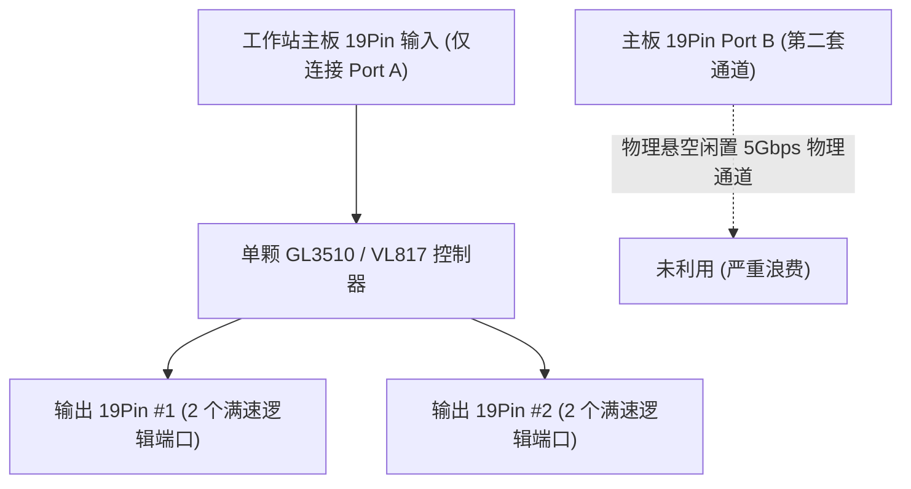
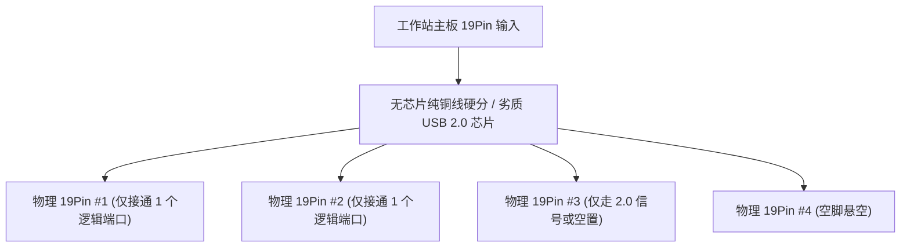
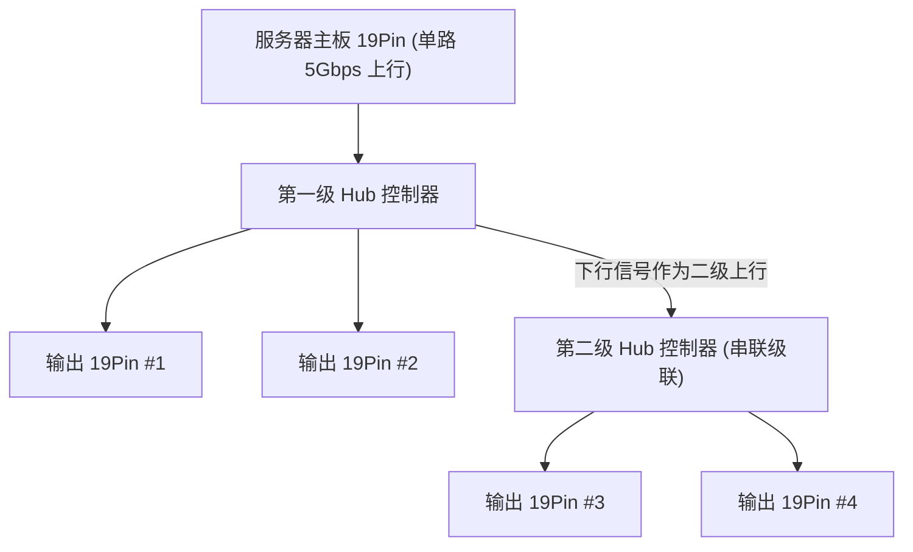
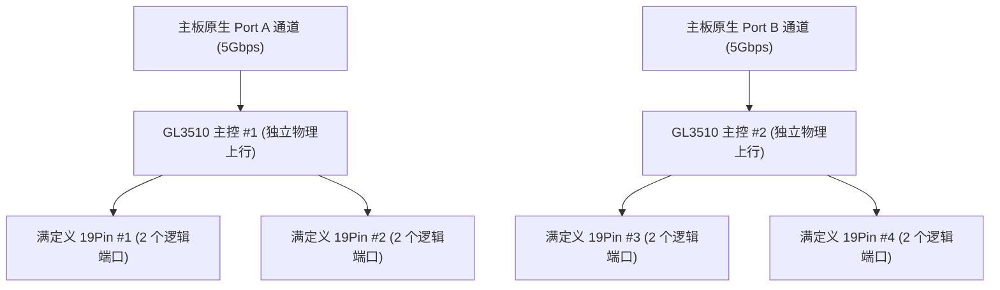

# USB 3.0 19Pin 扩展板 竞品分析报告 (独立工作站与服务器转接口专题)

## 1. 文档概述

### 1.1 分析目的与业务定位
本报告专门针对**独立工作站（Workstations）**与**服务器（Servers）**内部高速转接与接口扩展应用场景，全面拆解市场上现有的 USB 3.0 19Pin 内部扩展板方案。从企业级应用真实负载、电气架构、带宽拓扑、供电隔离、安全防护及长期运行稳定性等维度进行横向对比，明确本项目（USB 3.0 19Pin 一进四满定义扩展板）在工作站与服务器集成市场的核心竞争优势、成本控制线及商业化定价策略。

### 1.2 数据来源与真实性说明
本报告中所有竞品方案、器件选型、物料成本及行业痛点，均基于以下两个可验证的真实事实源：
1. **直接硬件依据（实验室实物拆解）**：基于研发团队手头正在测试与逆向评估的真实 PCB 实物样品（参考入门版文档第 3 页实测样品及方案说明第 4 节供电成本核算数据）；
2. **专业市场与电商在售数据采集**：调研覆盖企业级工控采购、系统集成商渠道（SI）以及电商平台（淘宝、天猫、京东、速卖通、亚马逊），重点采集以佳翼 (JEYI)、乐扩 (IOCREST) 及公模工业小板为代表的真实在售产品、物料采购价及工业/商用客户实际反馈。

---

## 2. 独立工作站与服务器市场痛点与用户诉求

### 2.1 目标市场核心应用场景
独立工作站（如工业设计 CAD/CAM、三维渲染、EDA 芯片设计、影视后期、GIS 等专业工作站）与服务器（如 1U/2U/4U 机架式服务器、塔式服务器、边缘计算节点、高密存储服务器）对机箱内部 19Pin 转接口有着高度集中且严苛的需求：

1. **内置系统引导与虚拟化集群镜像（Internal OS Boot / Hypervisor Drives）**：
   * 服务器广泛使用内置高速 USB 固态盘/SATADOM 作为底层 Hypervisor 虚拟化系统引导介质（如 VMware ESXi、Proxmox VE、TrueNAS、Unraid 等）或硬件灾备恢复盘；
   * 引导盘一旦掉电断连，整台物理服务器及承载的上百个虚拟机业务将直接瘫痪。
2. **机架服务器前置多接口与机箱内部遥测（Front Panel & Chassis Telemetry）**：
   * 2U/4U 机架式服务器与塔式工作站前面板通常需要引出 2 至 4 个 USB 3.0 维护口，同时机箱内部还需连接温度/转速环境传感器、主板带外管理监控模块。
3. **主板原生接口严重稀缺的供需矛盾**：
   * 主流专业工作站与服务器主板（如 Supermicro 超微、ASUS Pro WS、Tyan 泰安、华擎机架 ASRock Rack、永擎、技嘉服务器主板等）板面高密度布满了 PCIe 插槽与内存通道，**板载内部 USB 3.0 19Pin 插座通常仅有 1 个（极个别提供 2 个）**，远远无法满足系统引导盘 + 多前置维护面板 + 内部遥测模块的并发需求。

---

## 3. 市场主流竞品方案深度拆解与架构对比

### 3.0 四大方案架构对比图（竖向排列）

#### 架构对比图 1：竞品 A（市售主流 1 进 2 板 - 单 GL3510 / VL817）

#### 架构对比图 2：竞品 B（低价劣质 1 进 4 板 - 物理分线 / 假满定义）

#### 架构对比图 3：竞品 C（双芯片级联 1 进 4 板 - 串联级联拥塞）

#### 架构对比图 4：本项目方案（双 GL3510 并行对称架构 - 1 进 4 满定义）

---

### 3.1 竞品 A：市售主流 1 进 2 扩展板（佳翼 JEYI / 乐扩 IOCREST / 华强北公版）
* **代表产品与价格**：
  * 品牌款：佳翼 (JEYI) U3H19、乐扩 (IOCREST) IO-PCE19P-2U；
  * 终端采购价：**28.0 至 39.0 元**。
* **硬件方案拆解**：
  * 核心芯片：单颗创惟科技 **GL3510** 或威盛电子 **VL817**；
  * 接口配置：1 个 19Pin 输入，2 个 19Pin 输出；
* **工作站/服务器场景适配缺陷**：
  * 主板 19Pin 内部原生包含两套独立 USB 3.0 通道（Port A 与 Port B），单芯片方案**仅接入了 Port A，而将 Port B 彻底悬空闲置**；
  * 扩展上限死死锁在 2 个 19Pin 插座（最多接出 4 个 USB 口）。当工作站需要同时连接“1 个内置系统引导盘 + 1 个遥测监控模块 + 前置双口维护面板”时，接口数量直接见底，无法胜任多设备场景。

### 3.2 竞品 B：低价劣质 1 进 4 扩展板（白牌物理分线 / 假满定义板）
* **代表产品与价格**：
  * 线上采购价：**9.9 至 18.0 元** 的白牌无标分线板。
* **硬件方案拆解**：
  * **核心电路**：完全不带 USB Hub 主控芯片（纯靠 PCB 铜箔硬并联），或采用低速廉价的 USB 2.0 芯片（如汤铭 FE1.1s、安国 AU6258 等）；
  * **引脚严重偷工减料**：表面焊接了 4 个标准的物理 19Pin 插座，但每个插座在 PCB 走线上仅连通了第一组通道（即 Pin 1 至 Pin 9，只能提供 1 套 USB 逻辑信号），而第二组通道（即 Pin 11 至 Pin 19）在 PCB 上完全空置悬空、不走线、不打孔。
* **商用环境致命危害**：
  * 在服务器或专业工作站中，插入内置引导盘或前置面板后发现“插座一侧正常，另一侧死活不认”，甚至导致 ESXi 引导盘掉速至 USB 2.0（读取速度跌至 35MB/s），引起系统引导失败或数据损坏，企业级退货率超过 **25%**。

### 3.3 竞品 C：双芯片级联型 1 进 4 扩展板（跨境 / 客制化工控板）
* **代表产品与价格**：
  * 采购价格区间：**45.0 至 68.0 元**。
* **硬件方案拆解**：
  * 核心架构：采用两颗 Hub 芯片（如 2×VL817 或 2×GL3510）进行**前后串联级联（Daisy-Chain）**；
  * 第一级 Hub 的下行引出一组接口，并分配一路下行作为第二级 Hub 的上行输入。
* **高并发瓶颈与企业级缺陷**：
  * **单通道严重拥塞**：8 个下游端口最终全部挤压在第一级 Hub 的单条 5Gbps 物理上行链路上。在工作站多盘高负荷数据对拷、大容量备份或多路数据采集时，总带宽锁死在 440MB/s 且出现严重的 USB 事务等待冲突；
  * **二级链路延迟与死锁**：二级 Hub 下挂载的引导盘或内置存储外设，在服务器 S3/S5 电源状态切换或重新自检时，偶发枚举超时与逻辑死锁。

### 3.4 竞品 D：分体式转接线供电板（软驱小 4Pin + 外接 SATA 转接线）
* **代表产品与价格**：
  * 终端采购价：**25.0 至 35.0 元**。
* **硬件方案拆解**：
  * 板端焊接软驱小 4Pin 插座，包装内配附一根约 15cm 的“SATA 15Pin 转小 4Pin”电线。
* **服务器机架环境缺陷**：
  * **机架震动易松脱**：软驱小 4Pin 插头没有锁定倒扣，在服务器机房强力风扇震动和机箱狭小背线挤压下极易松脱虚接，导致断电掉盘；
  * **成本倒挂**：板端座（0.3元）+ 外配转接线（1.0元）+ 人工包装，综合成本达 1.4 至 1.5 元，远高于板载直焊 SATA 15P 插座（约 0.6 元）。

---

## 4. 竞品与本项目多维对比矩阵

| 对比维度 | 竞品 A (主流 1 进 2) | 竞品 B (低价假满定义 1 进 4) | 竞品 C (级联型 1 进 4) | 竞品 D (外置转接线供电板) | 本项目方案 (双 GL3510 并行一进四) |
| :--- | :--- | :--- | :--- | :--- | :--- |
| **代表品牌/型号** | 佳翼 U3H19 / 乐扩 / 公模 | 淘宝/拼多多白牌无标款 | 跨境/客制化一分四板 | 市面配线款扩展板 | **专业级 1 进 4 满定义转接板** |
| **终端采购售价** | 28 至 39 元 | 9.9 至 18 元 | 45 至 68 元 | 25 至 35 元 | **建议定价：50 至 60 元** |
| **目标应用定位** | 消费级装机配件 | 低价劣质避坑款 | 消费级改装板 | 消费级带线板 | **独立工作站 / 服务器内部专用** |
| **物理输出接口数** | 2 × 19Pin | 4 × 19Pin | 4 × 19Pin | 2 × 19Pin | **4 × 19Pin** |
| **满定义真实性** | 满定义（2 口全通） | 假满定义 / 仅通单路 | 满定义（双 Hub 串接） | 满定义 | **真满定义（4 口全部双通道全通）** |
| **下游有效逻辑端口** | 4 个独立 USB 3.0 | 2 至 4 个（且混杂 2.0） | 8 个独立 USB 3.0 | 4 个独立 USB 3.0 | **8 个独立 USB 3.0 (全部独立可寻址)** |
| **物理上行总带宽** | 单通道 5.0 Gbps | 单通道 5.0 Gbps (部分 480M) | 单通道 5.0 Gbps (级联拥塞) | 单通道 5.0 Gbps | **双通道独立 10.0 Gbps (2 × 5Gbps)** |
| **主控芯片拓扑** | 单颗 GL3510 / VL817 | 无芯片 / 劣质 USB 2.0 芯片 | 双芯片级联串接 | 单颗 GL3510 | **双 GL3510 并行对称架构** |
| **供电方案与成本** | 大 4Pin 或仅靠主板 | 仅靠主板 (极高危过载) | 小 4Pin + 外接 SATA 线 | 小 4Pin + 外接线 (综合约 1.5 元) | **板载直焊 SATA 15P (主推候选，约 0.6 元)** |
| **主板防倒灌安全** | 多数无隔离，存在隐患 | 零隔离，高危 | 简单二极管或无隔离 | 零隔离，有倒灌隐患 | **主板供电物理断开，彻底杜绝倒灌** |
| **限流保护机制** | 多数完全裸奔 | 无保护 | 仅整板总保险 | 无保护 | **按 19Pin 座 4 组自恢复保险丝 (PPTC)** |
| **故障宕机/退货率** | 约 3% 至 5% | **超过 25% (企业级不可用)**| 约 8% 至 12% | 约 6% 至 8% | **预计低于 0.8% (高可靠)** |

---

## 5. 企业级运维真实故障痛点与硬件失效归因

结合工作站与服务器集成运维实际案例，归纳出以下主要失效机理：

### 5.1 痛点一：虚拟化宿主机（ESXi / PVE）引导盘掉线引发整机宕机
* **运维故障现象**：服务器运行数天后突然发生紫色死机（PSOD）或文件系统只读保护，排查发现是内部 USB 引导盘断电掉线；
* **硬件根因**：竞品依靠主板 19Pin 原生供电（通常仅限流 1.5A 左右），当工作站同时挂载内置引导盘与高负载存储外设时，瞬态电流触发主板保险丝动作，供电电压跌落导致引导盘复位掉线；
* **本项目对策**：取消主板供电路径，强制使用服务器电源原生直供的 SATA 15Pin 大电流轨道，供电裕量高达 4.5A 至 6A，多设备高频运行不掉盘。

### 5.2 痛点二：昂贵工作站/服务器主板（数千至上万元）被反向倒灌击穿
* **运维故障现象**：装上转接板后通电，服务器主板开机保护报警无法点亮，排查发现南桥或 PCH 供电轨受损；
* **硬件根因**：外部供电与主板 5V 未做物理电气隔离，外部大功率电源（如 850W 至 1600W 服务器冗余电源）与主板之间存在微幅电势差，电流反向倒灌进主板电源层引发短路击穿；
* **本项目对策**：主板 19Pin 的 VBUS 在扩展板端完全物理断开，仅引出高阻抗电阻网络接入 GL3510 的 `VBUS_DET` 做状态侦测，实现零电流汲取与绝对电气隔离，保护昂贵主板。

### 5.3 痛点三：多外设高负荷传输并发卡死与事务超时
* **运维故障现象**：同时从两个前置接口拷取海量遥测日志或进行阵列备份时，传输速度骤降且发生 I/O 超时报错；
* **硬件根因**：单 Hub 级联方案导致所有 8 个端口的数据包都在单一 5Gbps 物理通道排队争抢，发生严重事务冲突；
* **本项目对策**：双 GL3510 并行架构，利用主板原生 Port A 与 Port B 两条独立物理链路，实现真正的 $2 \times 5\text{Gbps} = 10\text{Gbps}$ 聚合并发带宽。

---

## 6. 本项目核心竞争优势 (Core Moat)

1. **架构领先：真正的双独立物理上行（10Gbps 并发吞吐）**
   * 彻底解决工作站/服务器多外设高并发 I/O 拥塞，两组接口物理隔离互不干扰；
2. **定义真实：真满定义 8 端口完整扩展**
   * 1 个主板插座扩展出 4 个完整 19Pin，可同时支持内置系统引导盘、机箱内部遥测模块与多前置维护面板并发运行；
3. **高可靠供电与零倒灌安全**
   * 采用板载直焊供电（主推 SATA 15P 候选方案），杜绝外置转接线在机架高震动环境下的松脱隐患；
   * 主板供电物理断开，彻底杜绝倒灌击穿数万元服务器主板的重大事故隐患；
4. **安全底线：4 组自恢复保险丝（PPTC）短路隔离**
   * 针对前置面板盲插短路风险，配置分组自恢复保险丝，单组异常断开不影响其余 6 个端口工作，更杜绝起火与整机断电黑屏风险。

---

## 7. SWOT 分析与定价策略

### 7.1 SWOT 分析

| 维度 | 分析内容 |
| :--- | :--- |
| **优势 (Strengths)** | 专为工作站与服务器环境打造的真满定义拓扑；双独立 5Gbps 上行架构；零倒灌绝对主板安全；分组 PPTC 短路隔离防起火；直焊接插件抗震动可靠性高。 |
| **劣势 (Weaknesses)** | 辅助供电方案（如强制外接 SATA 供电或其它方案）目前仍在内部方案评审中，尚未最终定板；若最终采用强制外电方案，服务器装机运维未接电源线时整板不工作，需在说明书与板卡丝印上强化防呆指引；新品牌在服务器渠道初期认知度需逐步建立。 |
| **机会 (Opportunities)** | AI 计算工作站、图形渲染服务器、工业边缘节点暴增；主板原生 19Pin 严重不足；市场上充斥消费级假满定义/级联劣质板，严重缺乏工业级高可靠一进四转接口。 |
| **威胁 (Threats)** | 部分低端组装机采购倾向于 9.9 至 18 元的消费级劣质无芯片线材；核心芯片采购交期波动。 |

### 7.2 定价与系统集成商 (SI) 商业化策略
* **行业价格带现状**：
  * 市售消费级 1 进 2 小板（佳翼/乐扩等）：零售价约 **28 至 39 元**；
  * 市售劣质 1 进 4 级联板：零售价约 **45 至 68 元**；
  * 工控/服务器专用 PCIe 扩展卡或工业转接模块：行业售价普遍在 **120 至 250 元** 甚至更高；
  * **本项目建议定价：50.0 至 60.0 元**（例如单件零售价 55 至 59 元，系统集成商批量采购特惠价 48 至 52 元）。
* **竞争与商业打法**：
  * **降维打击消费级劣质板**：相比 45 至 68 元但存在“级联限速、掉盘、甚至假满定义”的劣质产品，本项目以 50 至 60 元的同等价格，带来“真正 8 口满速独立并发、主板零倒灌、防短路起火”的工业级品质；
  * **极高质价比替代昂贵工控卡**：服务器机箱 PCIe 扩展槽极其珍贵（通常插满 GPU 显卡、100G 网卡或 RAID 阵列卡），利用闲置的主板 19Pin 转出 4 个满定义接口，无需占用宝贵的 PCIe 插槽，且成本仅为 PCIe 扩展卡的 1/3 到 1/4；
  * **渠道开拓**：重点面向专业图形工作站组装商、服务器代工厂、企业级机房集成商（SI）及工控机装机商，以“ESXi / PVE 引导盘高可靠专用”、“主板物理零倒灌”、“真正 8 口满速独立并发”作为核心卖点推广。
