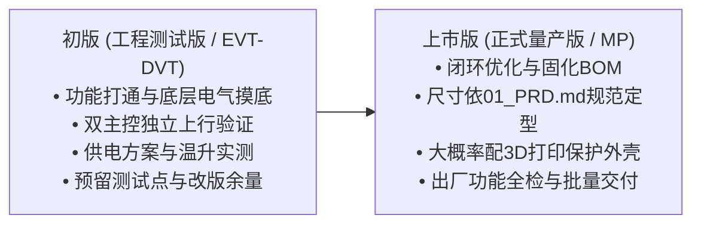
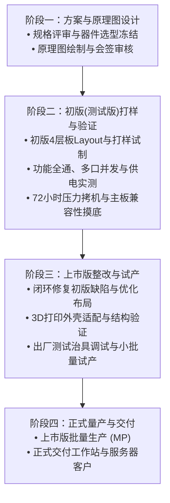

# USB 3.0 19Pin 扩展板 产品规划路线图

## 1. 规划概述与版本策略

### 1.1 规划愿景与核心定位
针对**独立工作站（Workstations）**与**企业级服务器（Servers）**内部高速转接与接口扩展的刚性需求，本项目采取务实、聚焦的工程落地路线，**仅设立“初版（工程测试版）”与“上市版（正式量产版）”两个关键迭代版本**：
* **初版（测试版）**：重在功能打通、底层电气摸底、信号完整性验证与供电方案实测；
* **上市版（量产版）**：重在闭环整改优化、固化量产 BOM、依据结构规范定型并完成大批量交付。

### 1.2 两阶段演进流程

---

## 2. 两阶段版本详细规划

### 2.1 初版（工程测试版 / EVT-DVT 阶段）
* **版本定位**：工程样机打样与全面摸底验证版，主要用于研发实验室内功能调试、电气压测及主板兼容性适配。
* **物理形态**：4 层阻抗沉金 PCB 裸板，样板试制数量为 5 至 10 套，便于飞线调试与探针量测。
* **硬件设计特征**：
  * **主控架构**：双 GL3510 并行对称架构，分别接入输入 19Pin 的 Port A 与 Port B 原生通道；
  * **测试点配置**：板面预留充足的排针与测试点（TP 点），覆盖 5V 输入轨、3.3V/1.2V 芯片核心电源轨、复位信号、主板 `VBUS_DET` 监测引脚及关键接地参考点；
  * **器件预留与改版余量**：ESD 保护阵列预留通用贴片焊盘；供电支路自恢复保险丝（PPTC）预留 1206/1812 兼容封装；两颗 GL3510 配置引脚（GANG Mode 与 Individual 模式）预留跳阻；
  * **结构布局初版**：尺寸参考 [01_PRD.md](file:///c:/Users/leiyu/Desktop/Document/work/USB3.0/01_Product_Definition/01_PRD.md) 规划范围（长度 57 至 65 mm、宽度 37 至 40 mm，推荐基准为 62 mm × 38 mm），端部布置输入 19Pin 与辅助供电座，长边布置 4 个输出 19Pin 插座。
* **核心测试与验证重点**：
  1. **枚举与协议兼容**：验证双 GL3510 在专业工作站与服务器主板（如超微 Supermicro、华硕 Pro WS、泰安 Tyan 等）下是否 100% 独立枚举识别；
  2. **8 逻辑端口满定义验证**：4 个 19Pin 插座共 8 个 USB 3.0 逻辑端口逐口读写测试，验证系统引导盘启动能力；
  3. **供电方案实测**：实测候选供电方案（如主推板载 SATA 15P）在 8 口重载下的压降表现（确保各端口电压保持在 4.75V 以上），验证主板 VBUS 物理断开时的零倒灌隔离；
  4. **高频差分信号完整性**：测试 USB 3.0 5Gbps SuperSpeed 差分对眼图质量、抖动（Jitter）与 90 欧姆阻抗公差；
  5. **机械防干涉校验**：实际插入两条带有厚橡胶外壳的机箱线束插头，测量插座间距是否顺畅，记录尺寸公差与装配体验。

### 2.2 上市版（正式量产版 / PVT-MP 阶段）
* **版本定位**：正式交付独立工作站组装商、服务器系统集成商 (SI) 及企业客户的标准化商用量产版。
* **物理形态**：最终外壳与绝缘方案目前处于评审待定状态，上市版**大概率采用定制 3D 打印保护外壳**（或根据批量规模评估绝缘垫/注塑方案）。
* **基于初版测试结果的优化与固化**：
  * **固化电路与元器件 BOM**：移除仅供研发调试的临时测试点与冗余跳阻，关闭不需要的配置脚，锁定稳定物料清单；
  * **尺寸与间距定型**：
    * 板卡尺寸严格依据 [01_PRD.md](file:///c:/Users/leiyu/Desktop/Document/work/USB3.0/01_Product_Definition/01_PRD.md) 机械结构规范，在长 57 至 65 mm、宽 37 至 40 mm 范围内最终锁定（推荐基准尺寸为 **长 62 mm × 宽 38 mm**）；
    * 严格固化同侧两只 19Pin 插座的中心间距（$\ge 30\text{ mm}$）与插座外壁净间距（$\ge 6\text{ mm}$），确保工程现场装机时厚插头 100% 不挤压、不干涉；
  * **电源方案与丝印防呆**：供电方案待最终评审敲定后，在 PCB 板端丝印明确供电连接与防呆指引；
  * **导入量产功能测试治具**：配套开发产线专用工装夹具，实现 8 组 USB3/USB2 端口读写、主控枚举、供电电压及短路保护的出厂全检。

---

## 3. 初版与上市版技术规格横向对比矩阵

| 对比维度 | 初版（工程测试版 / EVT-DVT） | 上市版（正式量产版 / PVT-MP） |
| :--- | :--- | :--- |
| **版本定位** | 内部实验调试、电气摸底、兼容性适配 | 商业交付、批量集成、企业级出货 |
| **PCB 工艺与层数** | 4 层阻抗板，测试批次沉金工艺 | 4 层高精度高 TG 阻抗板，工业级沉金工艺 |
| **测试点与调试接口** | 全面引出（电源轨、复位、时钟、模式跳阻） | 精简优化，仅保留产线必要测试点 |
| **主控芯片拓扑** | 2 × 创惟 GL3510（预留模式配置跳阻） | 2 × 创惟 GL3510（电路固化为 GANG 群组模式） |
| **供电方案设计** | 供电方案实测评估（主推板载 SATA 15P 候选） | 依据评审结论固化最终供电方案 |
| **保护元器件配置** | 预留不同维持电流 PPTC 焊盘与 ESD 焊盘 | 固化 4 组自恢复保险丝（维持电流 2.0A 至 2.5A） |
| **板卡尺寸与间距** | 参考 01_PRD.md（长 57 至 65 mm，宽 37 至 40 mm） | 依据 01_PRD.md 固化定型（推荐 62 mm × 38 mm，净间距 $\ge 6\text{ mm}$） |
| **外壳与防护形式** | 裸板调试，便于探针测量 | 大概率配定制 3D 打印保护外壳（方案待定） |
| **产线与测试要求** | 研发示波器、电子负载与协议分析仪逐项分析 | 专用产线工装测试治具 100% 出厂全检 |
| **交付客户对象** | 内部研发验证、小范围集成商样机送测 | 工作站装机商 (SI)、服务器代工厂、企业 IT 采购 |

---

## 4. 研发推进阶段安排与里程碑

### 4.1 各阶段里程碑与关键交付物

* **阶段一：需求与原理图设计**
  * 关键交付物：签审完成的系统设计说明书、OrCAD 原理图工程及初版元器件 BOM 清单；
  * 里程碑目标：确定双主控拓扑、引脚分配及候选供电电路原理图。
* **阶段二：初版（测试版）打样与工程验证**
  * 关键交付物：首批 5 至 10 套初版测试样机；
  * 里程碑目标：
    1. 验证双 GL3510 在专业主板上 100% 独立枚举识别；
    2. 验证 4 个 19Pin 插座共 8 个逻辑端口全部实现 SuperSpeed 满速读写；
    3. 完成 72 小时大文件持续满载循环读写压力烧机；
    4. 实测确认辅助供电压降达标、主板物理零倒灌。
* **阶段三：上市版整改与试产验证**
  * 关键交付物：闭环优化后的上市版 Gerber 生产文件、3D 打印外壳结构件、出厂测试治具；
  * 里程碑目标：小批量试产验证装配顺畅度，确保厚插头防干涉与电气功能全通。
* **阶段四：正式量产与批量交付**
  * 关键交付物：上市版批量入库，正式交付专业工作站集成商与企业客户；
  * 里程碑目标：产线综合直通率稳定达到指标。

---

## 5. 制造与质量保障标准

### 5.1 出厂测试治具规程
上市版通过专用测试治具实现出厂全检，确保每块交付板卡：
1. **短路与供电检测**：上电前检测各供电轨阻抗，防止短路板通电损坏设备，测量供电电压精度；
2. **主控枚举检测**：检测 2 颗 GL3510 的 USB 描述符与固件配置；
3. **8 端口读写与带载全检**：8 个下游 USB3/USB2 逻辑端口接入高速测试负载，瞬时抽检读写带宽与链路稳定性；
4. **合格判定输出**：给出明确的 Pass / Fail 声光指示，不良品记录具体故障点位。

### 5.2 质量保证指标
* **产线出厂直通率 (FPY)**：SMT 与插件后段综合直通率目标 $\ge 99.0\%$；
* **企业级年化返修率 (AFR)**：出厂 1 年内硬件故障返修率严格控制在 $\le 0.3\%$ 以内。
