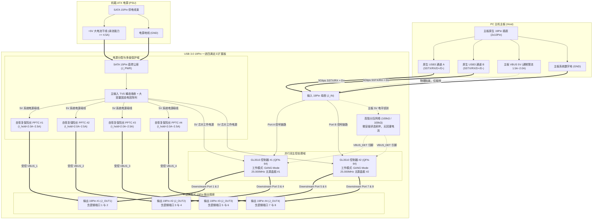
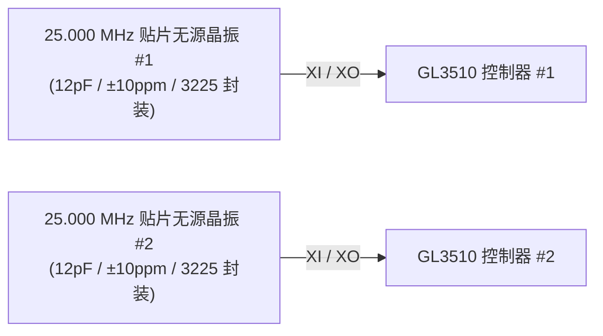
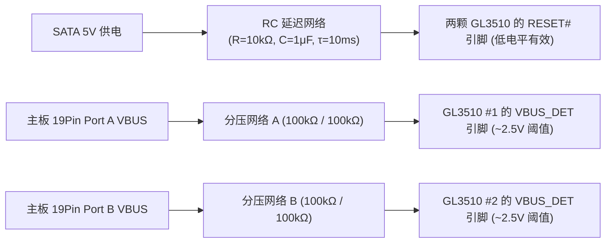
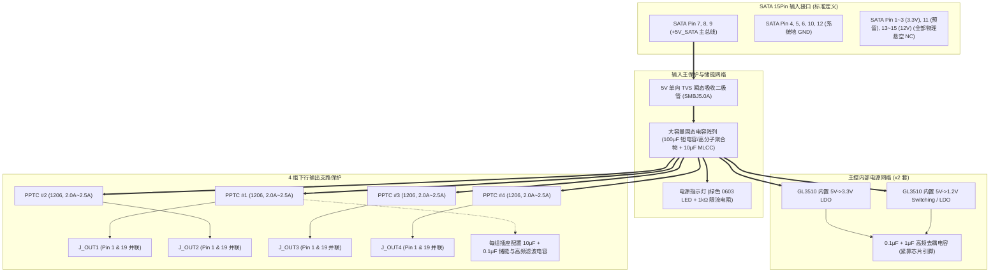
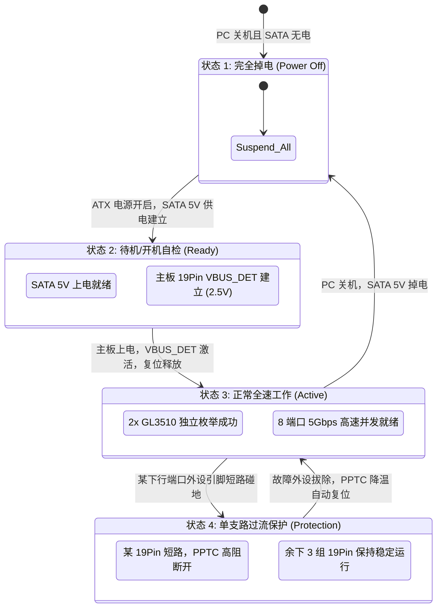

# USB 3.0 19Pin 一进四满定义扩展板 系统架构设计说明书

## 1. 文档概述与设计目标

### 1.1 文档目的与适用范围
本文档为 **USB 3.0 19Pin 一进四“满定义”扩展板**（以下简称“本产品”或“扩展板”）的系统架构设计规格书（System Architecture Specification）。
本文档依据 [01_PRD.md](file:///c:/Users/leiyu/Desktop/Document/work/USB3.0/01_Product_Definition/01_PRD.md) 的产品需求，详细定义全系统的硬件逻辑拓扑、芯片协同架构、数据流向模型、端口映射规则、时钟复位控制树、供电及电气隔离架构、机械布局规范以及信号完整性约束。

本文档作为系统级方案基准，为后续模块提供指导：
* **芯片与关键器件选型**（详见 `02_Chip_Selection.md`）；
* **电源与防倒灌详细计算**（详见 `03_Power_Design.md`）；
* **硬件原理图与 PCB Layout 设计**（详见 `03_Hardware_Design/` 目录）。

### 1.2 核心设计目标与系统边界
1. **满定义全速扩展**：
   * 充分利用主板原生单个 19Pin 插座内含的 **2 条独立 USB 3.0 逻辑通道**（Port A 与 Port B）；
   * 通过 **双 Hub 控制器并行架构**（非级联），将输入端 1 个 19Pin 扩展为 4 个物理 19Pin 输出插座；
   * 对外提供 **8 个完整独立、无降速的 USB 3.0 逻辑端口**（每个端口均包含独立 SuperSpeed 5Gbps 差分接收/发送对及 High-Speed D± 差分对）。
2. **纯外部供电与零倒灌隔离**：
   * 强制采用机箱内标准 **SATA 15Pin 辅助供电接口** 作为整板及外设的唯一能量来源；
   * 主板原生 19Pin 供电引脚在板端**物理切断**，仅保留高阻侦测网络（侦测电流 $< 25\mu\text{A}$），实现主板供电与扩展板供电绝对物理隔离，彻底根除倒灌烧板风险。
3. **低成本无源分组保护**：
   * 放弃高成本、占布线空间的 8 路独立有源限流芯片方案；
   * 采用 **4 组贴片自恢复保险丝（PPTC，维持电流 $2.0\text{A} \sim 2.5\text{A}$）** 按 19Pin 插座分组保护，结合主控 GANG 模式，达成极佳的安全性与成本平衡。
4. **超紧凑机电一体化设计**：
   * 成品 PCB 尺寸严格控制在 **$62\text{mm} \times 38\text{mm}$** 范围内；
   * 采用“短边进线（19Pin 母座与 SATA 供电座）、长边出线（对称分布 4 组 19Pin 公座）”的高效拓扑，插座中心距 $\ge 30\text{mm}$，完全消除机箱粗线缆插拔干涉。

### 1.3 核心技术指标一览

| 参数类别 | 规格指标 | 备注说明 |
| :--- | :--- | :--- |
| **上行接口 (Upstream)** | 1 × 标准 2×10Pin 接口 (物理 19Pin 母座) | 承载 2 组独立 USB 3.0 逻辑通道 (Port A & Port B) |
| **下行接口 (Downstream)**| 4 × 标准 2×10Pin 弯头/直插公座 (物理 19Pin) | 共对外提供 8 组独立满定义 USB 3.0 端口 |
| **辅助供电接口** | 1 × 直焊式标准 SATA 15Pin 公座 | 仅取用 +5V 与 GND 引脚，+12V 与 +3.3V 悬空 |
| **传输协议支持** | USB 3.1 Gen 1 (5Gbps)、USB 2.0 (480Mbps)、USB 1.1 | 协议免驱，兼容 Win 10/11、Linux、macOS |
| **核心主控芯片** | 2 × 创惟科技 (Genesys Logic) GL3510-QFN64 | 双控制器对称并行工作，GANG 供电监控模式 |
| **单口持续供电能力** | 额定 $5\text{V} / 0.9\text{A}$ (短时允许 $\ge 1.5\text{A}$) | 每组 19Pin 插座限流阈值约 $2.0\text{A} \sim 2.5\text{A}$ (PPTC) |
| **PCB 物理规格** | $62\text{mm} \times 38\text{mm}$，4 层高 TG FR-4，板厚 1.6mm | 控制差分阻抗 $90\Omega \pm 10\%$，沉金工艺 |

---

## 2. 系统整体拓扑与数据流架构

### 2.1 全系统总体架构框图

扩展板整体硬件架构由 **输入级 (Upstream Interface)**、**主控处理级 (Dual Hub Controllers)**、**输出级 (Downstream Interface)**、**电源管理与保护级 (Power & Protection)** 四大部分组成。



### 2.2 上行双通道非级联并行架构深度剖析
市面低端“一拖四”扩展板通常存在两大工程硬伤：
1. **伪满定义（半定义）**：仅连接主板 19Pin 的一组信号，输出端 19Pin 只有一组插针通电通数据，另一半为死引脚；
2. **三芯片级联瓶颈**：先用 1 颗 Hub 分出 2 口，再分别级联 2 颗 Hub，导致 USB 层级变深、上行总带宽被严重卡死在单条 5Gbps，且极易引发 USB 拓扑层级超限（USB 规范最多允许 5 层 Hub 级联）。

**本架构的核心优势**：
* **充分榨干主板物理潜能**：PC 主板原生 19Pin 内部本质上就是两个独立 USB 3.0 控制器端口在同一物理外壳中的封装。本设计使用 2 颗 GL3510 分别直接对接到主板的 Port A 和 Port B；
* **物理独立双上行带宽（10Gbps 总吞吐）**：
  * 控制器 #1 独享 Port A 的 5Gbps SuperSpeed 物理链路，专供下行 19Pin #1 与 #2（4 个逻辑端口）；
  * 控制器 #2 独享 Port B 的 5Gbps SuperSpeed 物理链路，专供下行 19Pin #3 与 #4（4 个逻辑端口）；
  * 两颗芯片并行运算、互不抢占上行 FIFO 与协议栈，双盘并发测试读取速率可达 $850\text{MB/s} \sim 900\text{MB/s}$。

### 2.3 下行 8 端口组织逻辑与映射关系

每个标准 19Pin 物理插座包含 2 套独立的 USB 3.0 通道。下行 4 个 19Pin 插座（共 8 个逻辑端口）与两颗 GL3510 的物理引脚绑定关系如下表：

```
主板 19Pin 输入 (J_IN)
 ├── Port A (逻辑通道 1) ──> GL3510 #1 ──┬── Downstream Port 1 ──┐ 组装为 J_OUT1 (输出 19Pin #1)
 │                                       ├── Downstream Port 2 ──┘
 │                                       ├── Downstream Port 3 ──┐ 组装为 J_OUT2 (输出 19Pin #2)
 │                                       └── Downstream Port 4 ──┘
 └── Port B (逻辑通道 2) ──> GL3510 #2 ──┬── Downstream Port 1 ──┐ 组装为 J_OUT3 (输出 19Pin #3)
                                         ├── Downstream Port 2 ──┘
                                         ├── Downstream Port 3 ──┐ 组装为 J_OUT4 (输出 19Pin #4)
                                         └── Downstream Port 4 ──┘
```

---

## 3. 端口映射与物理引脚分配方案

### 3.1 主板原生 19Pin 输入端引脚定义 (Standard 19Pin Pinout)
输入端采用 2×10Pin 物理母座（Pin 20 防呆拔除），其标准引脚电气分配如下表：

| 引脚编号 | 引脚名称 | 信号属性 | 所属逻辑端口 | 目标去向与系统处理说明 |
| :---: | :--- | :--- | :---: | :--- |
| **1** | VBUS_1 | 电源输入 (+5V) | Port A | **不接入系统供电网！**仅引至 100kΩ 分压电阻做开机检测 |
| **2** | SSRX1- | 高速差分入 (-) | Port A | 串接 ESD 阵列，直连 GL3510 #1 的 `US_SSRXM` |
| **3** | SSRX1+ | 高速差分入 (+) | Port A | 串接 ESD 阵列，直连 GL3510 #1 的 `US_SSRXP` |
| **4** | GND | 系统数字地 | - | 直连主板完整参考地平面 (Layer 2) |
| **5** | SSTX1- | 高速差分出 (-) | Port A | 串接 0.1μF AC 耦合电容 + ESD，接 GL3510 #1 `US_SSTXM` |
| **6** | SSTX1+ | 高速差分出 (+) | Port A | 串接 0.1μF AC 耦合电容 + ESD，接 GL3510 #1 `US_SSTXP` |
| **7** | GND | 系统数字地 | - | 直连主板完整参考地平面 (Layer 2) |
| **8** | D1- | USB 2.0 差分 (-) | Port A | 串接 ESD 阵列，直连 GL3510 #1 的 `US_DM` |
| **9** | D1+ | USB 2.0 差分 (+) | Port A | 串接 ESD 阵列，直连 GL3510 #1 的 `US_DP` |
| **10** | ID / NC | 悬空 / 预留地 | - | 默认悬空 (部分线缆用于地屏蔽连接) |
| **11** | D2+ | USB 2.0 差分 (+) | Port B | 串接 ESD 阵列，直连 GL3510 #2 的 `US_DP` |
| **12** | D2- | USB 2.0 差分 (-) | Port B | 串接 ESD 阵列，直连 GL3510 #2 的 `US_DM` |
| **13** | GND | 系统数字地 | - | 直连主板完整参考地平面 (Layer 2) |
| **14** | SSTX2+ | 高速差分出 (+) | Port B | 串接 0.1μF AC 耦合电容 + ESD，接 GL3510 #2 `US_SSTXP` |
| **15** | SSTX2- | 高速差分出 (-) | Port B | 串接 0.1μF AC 耦合电容 + ESD，接 GL3510 #2 `US_SSTXM` |
| **16** | GND | 系统数字地 | - | 直连主板完整参考地平面 (Layer 2) |
| **17** | SSRX2+ | 高速差分入 (+) | Port B | 串接 ESD 阵列，直连 GL3510 #2 的 `US_SSRXP` |
| **18** | SSRX2- | 高速差分入 (-) | Port B | 串接 ESD 阵列，直连 GL3510 #2 的 `US_SSRXM` |
| **19** | VBUS_2 | 电源输入 (+5V) | Port B | **不接入系统供电网！**并联至 Pin 1 侦测点或悬空 |
| **20** | KEY | 机械防呆空脚 | - | 无物理引脚 (空缺防呆插孔) |

### 3.2 下行 4 组 19Pin 输出端与 GL3510 逻辑端口映射矩阵
下行 4 个插座全部严格保持“标准满定义”线序，确保用户机箱前面板线束直插即可点亮双 USB 口。

| 物理插座位号 | 插座引脚区间 | 对应主控与逻辑端口 | 承载信号定义 | 对应受控 VBUS 电源网 |
| :--- | :--- | :--- | :--- | :--- |
| **J_OUT1**<br>(输出 19Pin #1) | Pin 1 ~ 9 | **GL3510 #1 : Port 1** | SSRX1±, SSTX1±, D1± | 统一由 **PPTC #1** 供电<br>(网络标号: `VBUS_OUT1`) |
| | Pin 11 ~ 19 | **GL3510 #1 : Port 2** | SSRX2±, SSTX2±, D2± | |
| **J_OUT2**<br>(输出 19Pin #2) | Pin 1 ~ 9 | **GL3510 #1 : Port 3** | SSRX3±, SSTX3±, D3± | 统一由 **PPTC #2** 供电<br>(网络标号: `VBUS_OUT2`) |
| | Pin 11 ~ 19 | **GL3510 #1 : Port 4** | SSRX4±, SSTX4±, D4± | |
| **J_OUT3**<br>(输出 19Pin #3) | Pin 1 ~ 9 | **GL3510 #2 : Port 1** | SSRX1±, SSTX1±, D1± | 统一由 **PPTC #3** 供电<br>(网络标号: `VBUS_OUT3`) |
| | Pin 11 ~ 19 | **GL3510 #2 : Port 2** | SSRX2±, SSTX2±, D2± | |
| **J_OUT4**<br>(输出 19Pin #4) | Pin 1 ~ 9 | **GL3510 #2 : Port 3** | SSRX3±, SSTX3±, D3± | 统一由 **PPTC #4** 供电<br>(网络标号: `VBUS_OUT4`) |
| | Pin 11 ~ 19 | **GL3510 #2 : Port 4** | SSRX4±, SSTX4±, D4± | |

> **[!IMPORTANT] 满定义供电引脚细节**：
> 在每个输出 19Pin 插座中，Pin 1 (Port A 供电) 与 Pin 19 (Port B 供电) **在 PCB 走线层必须直接打通并联**，共同挂接在所属插座对应的 PPTC 输出端。
> 这样可使该插座内的两个 USB 端口共享 PPTC 的 $2.0\text{A} \sim 2.5\text{A}$ 额定电流池（单口插入高功耗设备时允许短暂超额借流，两个口均插常规设备时平衡分配）。

### 3.3 SuperSpeed AC 耦合电容与极性配置规范
* **电容规格**：USB 3.0 规范强制要求在所有 SuperSpeed 发送端 (TX) 差分线上串联交流耦合电容。选用 **$0.1\mu\text{F}\ (100\text{nF}) \pm 10\%$，X7R / X5R 材质，耐压 $\ge 10\text{V}$，0402 紧凑贴片封装**；
* **部署位置要求**：
  * **上行发送端 (Upstream TX)**：J_IN 插座引来的 SSTX 差分对上，电容放置在靠近 J_IN 插座处；
  * **下行发送端 (Downstream TX)**：GL3510 下行输出的 8 组 `DN_SSTX±` 差分对上，电容紧邻 GL3510 芯片引脚引出端放置；
  * **接收端 (RX)**：接收对由主机端或外设发射端负责电容隔直，扩展板上的 `SSRX` 走线**严禁串联电容**，必须直连（直通并加挂 ESD 抑制器）。

---

## 4. 时钟、复位与主控硬件配置策略

### 4.1 独立 25MHz 晶振时钟拓扑
两颗 GL3510 控制器对系统时钟抖动（Jitter）和频偏要求极为严格（SuperSpeed 5Gbps 物理层要求参考时钟为 25.000MHz，频偏 $\le \pm 50\text{ppm}$）。



* **架构决策：坚决采用“双独立晶振”方案**
  * *为什么不用单晶振驱动两片芯片？* 单个无源晶体无法同时驱动两个反相放大器；若使用有源晶振并联分配，会增加高昂的有源振荡器成本（增加 1.5~2.5 元）并引入时钟走线跨板长距离辐射与串扰。
  * *工程方案*：为 GL3510 #1 与 #2 分别配置独立的 **25.000 MHz 无源贴片晶体**，匹配高频陶瓷负载电容（取值约 $12\text{pF}$，实际取值根据晶振负载电容 $C_L=12\text{pF}$ 及 PCB 杂散电容精确匹配）。晶振紧靠芯片 `XI/XO` 引脚放置，下方铺地包围，严禁穿层走线。

### 4.2 系统复位时序与独立主机侦测控制
两颗 GL3510 芯片内部均集成了上电复位电路 (Power-On Reset, POR)，但为应对 PC 开机瞬间 ATX 电源 5V 爬升斜率不确定、热插拔抖动等复杂工况，板级必须设计可靠的外部复位与时序保持电路：



1. **复位引脚配置**：GL3510 复位引脚为低电平有效 (`RESET#`)。配置 $10\text{k}\Omega$ 上拉电阻至 3.3V，并联 $1\mu\text{F}$ 贴片电容接地，硬件提供约 $10\text{ms}$ 的充放电延时，确保主电源及芯片内部 3.3V/1.2V LDO/DC-DC 输出完全稳定后才释放复位。
2. **主机连接双路独立侦测 (VBUS_DET)**：
   * 主板输入端包含 Port A 与 Port B 两路独立 VBUS（Pin 1 与 Pin 19）；
   * 为实现真正绝对的“电气防倒灌与物理隔离”，**严禁将两路主板 VBUS 盲目短接**，而是分别配置两套独立的 $100\text{k}\Omega / 100\text{k}\Omega$ 分压网络（共 4 颗 100kΩ 电阻），分别引至 GL3510 #1 与 GL3510 #2 的 `VBUS_DET` 引脚；
   * 控制器在检测到 `VBUS_DET` 有效后启动 USB 握手流程；当主机关机时分压网络迅速跌落至 0V，主控立即进入挂起（Suspend）模式。

### 4.3 GL3510 关键工作模式硬件引脚配置表

为了达到极致的稳定性并减少走线复杂度，两颗主控芯片的关键策略引脚统一通过板载上拉/下拉固定电阻进行硬件配置（Pin-Strapping）：

| 配置功能项 | 对应 GL3510 引脚 | 推荐电平配置 | 硬件电路实现 | 选定该模式的工程设计理由 |
| :--- | :--- | :---: | :--- | :--- |
| **参考电流校准 (RTERM)** | `RTERM` (Pin 16) | **精密对地电阻** | **$20\text{k}\Omega \pm 1\%$ 直连 GND** | **【芯片必备】** 规格书强制要求用于 PHY 内部偏置电流校准，两颗芯片各需 1 颗 20kΩ 1%。 |
| **供电模式 (Power Mode)** | `SELF_PWR` / `BUS_PWR` | **高电平 (High)** | $10\text{k}\Omega$ 上拉至 3.3V | 配置为 **Self-Powered（自供电模式）**。Hub 向上位机上报自身为独立外接电源设备，不从主板申请大电流额度。 |
| **端口4使能控制 (FN_B)** | `FN_B` (Pin 23) | **悬空 (Floating)** | 保持悬空，严禁下拉接地 | **【严禁下拉】** 下拉 10k 会直接将 Port 4 硬件禁用！悬空保持 Port 4 为不可拆卸满载模式。 |
| **电源开关模式 (PWRENJ)** | `PWRENJ` (Pin 34) | **悬空 (Floating)** | 保持悬空 | 配合下游纯自恢复保险丝（PolyFuse），按官方 PolyFuse 拓扑保持开路，无需下拉。 |
| **电池充电支持 (BC 1.2)** | `BC_EN` | **低电平 (Low)** | $10\text{k}\Omega$ 下拉至 GND | 关闭 CDP/DCP 握手模式。PC 机箱内扩展板专注于标准 USB 3.0 高速数据传输与外设稳定通讯。 |
| **LED 指示模式** | `LED_MOD` | 悬空 / 默认 | 芯片内部弱下拉 | 板载仅保留 1 颗 SATA 5V 电源指示灯。 |
| **配置接口预留** | `SCL` / `SDA` | **上拉 (High)** | 各串 $4.7\text{k}\Omega$ 上拉至 3.3V | 默认不贴外置 EEPROM，芯片加载内置固件。 |

---

## 5. 系统级供电拓扑与电气隔离架构

### 5.1 单一 SATA 5V 电源域与主板供电隔离拓扑

根据 PRD 核心技术决策，整板电源树（Power Tree）必须彻底执行**单一电源域**原则。



### 5.2 主板开机感知机制与零倒灌验算
* **主板 5V 隔离物理实现**：J_IN 插座的 Pin 1 与 Pin 19 焊盘与 PCB 内部的任何电源平面均**完全无电气直连**。
* **高阻分压网络参数推导**：
  * 电路连接：主板 5V $\rightarrow R_1 (100\text{k}\Omega) \rightarrow \text{节点 } V_{sense} \rightarrow R_2 (100\text{k}\Omega) \rightarrow \text{GND}$；
  * 节点 $V_{sense}$ 分压输出为：
    $$V_{sense} = 5\text{V} \times \frac{100\text{k}\Omega}{100\text{k}\Omega + 100\text{k}\Omega} = 2.5\text{V}$$
    完全落在 GL3510 的 `VBUS_DET` 高电平有效识别区间（$2.0\text{V} \sim 3.3\text{V}$）；
  * **反向漏电流极小化验算**：
    从主板抽取的静态电流仅为：
    $$I_{sense} = \frac{5\text{V}}{100\text{k}\Omega + 100\text{k}\Omega} = 25\mu\text{A}$$
    此电流远低于主板待机微安级漏电门限。当外接 SATA 供电未接通时，即使主板通电，由于板卡上无任何低阻负载通路，主板供电**绝不可能被外借**；当主机休眠关闭 19Pin 5V 时，扩展板上的任何能量也因 $100\text{k}\Omega$ 的阻断而**绝不可能倒灌入主板**。

### 5.3 四组分支 PPTC 限流与保护拓扑
* **选型关键指标**：
  * 采用 1206 贴片封装高分子自恢复保险丝（PPTC）；
  * 维持电流（Hold Current）$I_{hold} = 2.0\text{A}$（常温 25°C 环境）；
  * 触发跳断电流（Trip Current）$I_{trip} \approx 4.0\text{A}$；
  * 最大承受耐压 $V_{max} \ge 6\text{V}$，最大短路冲击耐流 $I_{max} \ge 50\text{A}$；
  * 典型初始冷态内阻 $R_{min} \approx 0.02\Omega \sim 0.05\Omega$。
* **短路故障隔离表现**：
  * 当某个机箱前面板 USB 插头金属短路碰地时，回路电流瞬时飙升至 $> 10\text{A}$；
  * PPTC 在 $0.1\text{s} \sim 0.5\text{s}$ 内由于剧烈焦耳热效应迅速进入高阻状态（数千欧姆），将故障支路电流限制在数毫安级别；
  * 该动作不会拉塌整板 SATA 5V 母线，其余 3 组 19Pin 插座（共 6 个逻辑端口）供电完全正常，主机系统亦不会触发 ATX 黑屏关机；
  * 故障排除冷却后，PPTC 自动恢复低阻导通状态。

---

## 6. 机电外形与 PCB 空间布局架构

### 6.1 PCB 物理尺寸与接口四向空间拓扑图

板卡外形确定为长方形，外形尺寸精准锁定为 **长 $62.0\text{mm} \times$ 宽 $38.0\text{mm}$**（公差 $\pm 0.2\text{mm}$）。四个边框均设置物理接口，形成高度对称、走线距离最短的“四向出线”空间拓扑。

```text
                                长边 1 (62.0 mm)
         [J_OUT1: 输出 19Pin #1]             [J_OUT2: 输出 19Pin #2]
         +---------------------------------------------------------+
         |   [PPTC #1]                            [PPTC #2]        |
         |        \                                  /             |
短边 1   |      +-------------+                  +-------------+   |  短边 2
(38.0 mm)|      |  GL3510 #1  |                  |  GL3510 #2  |   | (38.0 mm)
[J_IN]   |      |  (QFN-64)   |   走线与隔离区   |  (QFN-64)   |   | [J_PWR]
19Pin母座|      +-------------+                  +-------------+   | SATA 15Pin
(输入端) |        /   |                              |   \         | 供电公座
         |   [PPTC #3]|                              |[PPTC #4]    | (大电流)
         |            |                              |             |
         +---------------------------------------------------------+
         [J_OUT3: 输出 19Pin #3]             [J_OUT4: 输出 19Pin #4]
                                长边 2 (62.0 mm)
```

### 6.2 布局关键机械间距与防干涉约束
1. **长边并排插座间距**：
   * J_OUT1 与 J_OUT2（以及 J_OUT3 与 J_OUT4）中心距严格设定为 **$\ge 30.0\text{mm}$**；
   * 两个插座塑料胶壳间留有 $\ge 6.0\text{mm}$ 的净空距离。这能够完美兼容市面上各种加厚带屏蔽层的机箱前置 19Pin 线缆外壳，杜绝因插头太胖而无法同时并排插入的装机翻车隐患。
2. **两颗主控对称中央布置**：
   * GL3510 #1 位于板卡左中区域，紧靠 J_OUT1 与 J_OUT3；
   * GL3510 #2 位于板卡右中区域，紧靠 J_OUT2 与 J_OUT4；
   * 这种对称布局确保所有 8 组下行高速差分信号的走线长度皆控制在 $15\text{mm} \sim 35\text{mm}$ 之内，大幅降低走线高频衰减与插损。
3. **固定与机箱安装方案**：
   * 板卡四角各设置 1 个直径 $2.5\text{mm} \sim 3.0\text{mm}$ 的非金属化/接地安装过孔，兼容机箱 2.5 英寸硬盘位孔距或专用绝缘铜柱安装；
   * 板底配套提供定制厚度 $1.5\text{mm}$ 的耐高温阻燃 EVA/硅胶绝缘背胶垫，支持用户在机箱背线仓任意平整钣金处快速免螺丝粘贴固定。

### 6.3 4 层 PCB 叠层架构 (Layer Stackup)

高速 SuperSpeed 5Gbps 信号对高频阻抗和参考地平面连续性有极高要求，本项目强制采用 **4 层阻抗控制板**：

| 层序号 | 层名称 | 铜厚 | 主要承载功能与布线规则 |
| :---: | :--- | :---: | :--- |
| **Layer 1** | **Top Layer** (信号层) | 1.0 oz | **主高速信号走线与元器件贴片层**。所有 USB 3.0 SuperSpeed 差分对 (90Ω) 及 USB 2.0 差分对优先布设在顶层，以 Layer 2 作为完整无损的地参考平面。 |
| **Layer 2** | **GND Plane** (地平面) | 1.0 oz | **完整连续参考地层**。整层大面积铺地铜，严禁任何走线跨岛分割，为顶层高速信号提供极佳的回流路径与屏蔽。 |
| **Layer 3** | **PWR / Sig** (电源/次级信号) | 1.0 oz | **大电流电源分配层**。SATA 5V 宽铜皮（线宽 $\ge 80\text{mil}$）大面积铺设，容纳 PPTC 次级配电线路及非敏感控制引脚走线。 |
| **Layer 4** | **Bottom Layer** (底层走线/地) | 1.0 oz | **辅助布线与大面积地屏蔽层**。容纳次级低速控制线，其余区域大面积覆地铜并通过阵列地过孔与 Layer 2 相连。 |

---

## 7. 信号完整性 (SI) 与电磁兼容 (EMC) 规范

### 7.1 差分阻抗控制规范
* **USB 3.0 SuperSpeed 对 (SSTX±, SSRX±)**：严格控制特征差分阻抗为 **$90\Omega \pm 10\%$**（即 $81\Omega \sim 99\Omega$）；
* **USB 2.0 High-Speed 对 (D+, D-)**：严格控制特征差分阻抗为 **$90\Omega \pm 10\%$**；
* **共模阻抗**：单端特性阻抗控制在 $45\Omega \pm 10\%$。

### 7.2 高速走线物理拓扑规则
1. **等长与相位匹配 (Phase Skew)**：
   * 差分对内（Intra-pair，即 + 与 - 之间）的长度误差必须控制在 **$\le 5\text{mil}$ ($0.127\text{mm}$)** 以内；
   * 长度补偿采用平缓的微蛇形弯（曲率半径 $\ge 3\times$ 线宽），补偿点紧邻产生长度差异的弯头区域。
2. **过孔与换层约束**：
   * 所有 SuperSpeed 差分线尽量全链路在 Top 层直走，避免换层；
   * 若空间限制必须过孔换层，单对差分线过孔数量严禁超过 2 个；
   * 换层过孔旁 **$\le 40\text{mil}$** 范围内必须打一对伴随接地过孔（GND return via），保证高频回流路径阻抗不突变。
3. **隔离与包地 (Shielding & Spacing)**：
   * 差分对与差分对之间必须遵循 **$3\text{W}$ 原则**（边沿间距 $\ge 3 \times$ 差分线到参考层厚度）；
   * 严禁差分线跨越任何电源分割区（严禁跨越 Layer 2 地平面的任何缝隙）。

### 7.3 ESD 静电放电防护拓扑
* 所有与机箱外接长线束直接连通的插座端口（J_IN 及 J_OUT1~4 的全部差分引脚），必须在靠近插座焊盘处布置超低结电容 ESD 阵列芯片；
* **结电容约束**：SuperSpeed 线路 ESD 芯片引脚结电容必须 **$< 0.4\text{pF}$**（推荐选用 DFN-10P 或 SOT-23-6 封装的超低容专用阵列，如 USBLC6-2SC6 或 ESD7383），防止高频眼图产生畸变闭合。

---

## 8. 系统状态机与异常工况处理

### 8.1 系统运行状态机



### 8.2 异常工况响应机制
1. **未插 SATA 电源线**：
   * 现象：用户仅插上了主板 19Pin 线缆，忘记接 SATA 供电线；
   * 动作：全板无工作电源，GL3510 不枚举，下行端口无 5V 输出；
   * 评价：表现为完全不工作，促使用户立即检查电源连线，避免因微弱供电导致移动硬盘损坏或逻辑报错。
2. **机箱前置插头短路**：
   * 现象：用户机箱前置面板内部接线破损碰地，导致 5V 与 GND 直通；
   * 动作：该支路 PPTC 在 0.2 秒内跳变为高阻状态，限制短路发热；
   * 评价：PC 主机不关机、主板不烧保险、其余端口数据传输不中断。

---

## 9. 交付物衔接指引

本系统架构设计说明书已全面锁定扩展板的信号拓扑、硬件配置与机电边界。后续设计模块依循本架构展开：
* **器件选型对接** $\rightarrow$ 进入 [02_Chip_Selection.md](file:///c:/Users/leiyu/Desktop/Document/work/USB3.0/02_System_Design/02_Chip_Selection.md)：选定 GL3510 封装后缀、PPTC 具体型号规格、TVS 器件参数与连接器接插件料号；
* **电源计算对接** $\rightarrow$ 进入 [03_Power_Design.md](file:///c:/Users/leiyu/Desktop/Document/work/USB3.0/02_System_Design/03_Power_Design.md)：开展大电流铜箔线宽计算、PPTC 动作时延与压降验算、去耦电容阶梯分布及发热温升推导；
* **成本核算对接** $\rightarrow$ 进入 `04_Cost_Analysis.xlsx`：核算包含两颗 GL3510 及 4 组 19Pin 接口在内的综合批量 BOM 成本。
