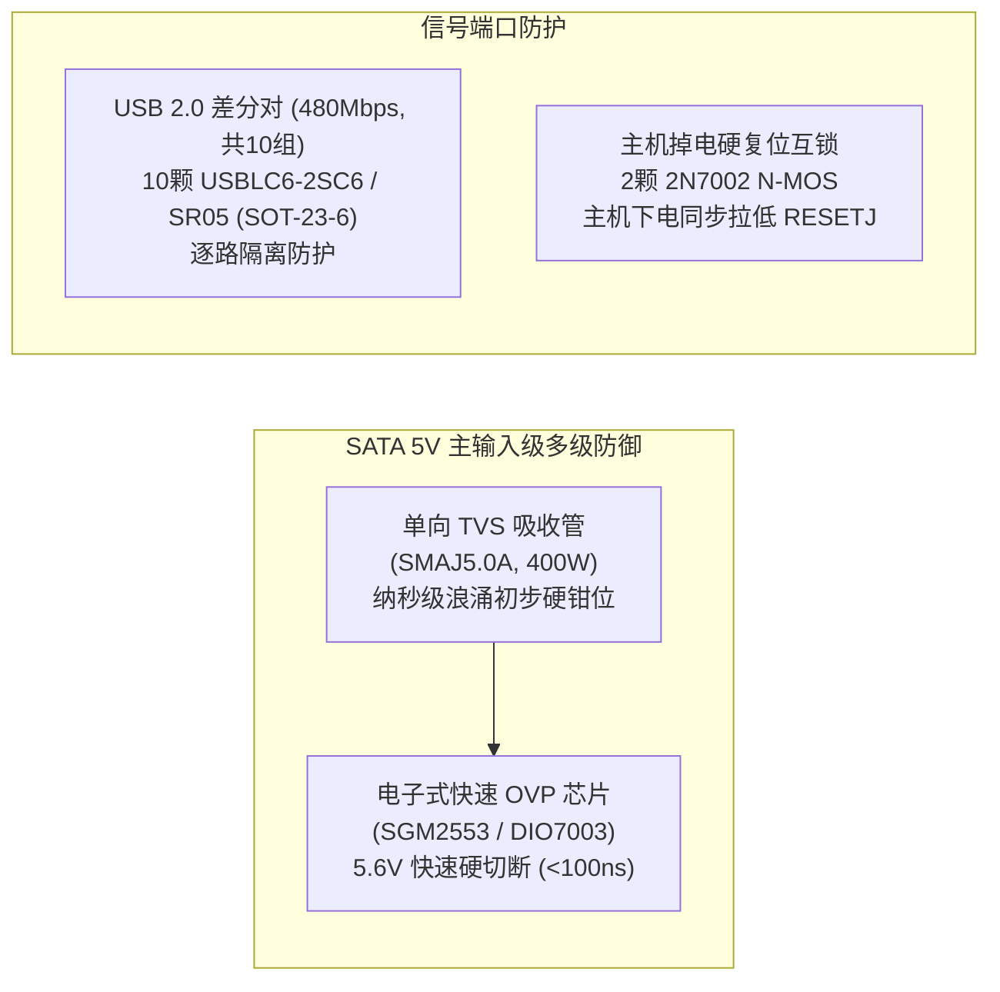

# USB 3.0 19Pin 一进四满定义扩展板 芯片与关键器件选型说明书

## 1. 文档概述与选型原则

### 1.1 文档目的
本文档为 **USB 3.0 19Pin 一进四“满定义”扩展板** 的关键元器件选型说明书（Chip & Component Selection Specification）。
文档依据 [01_PRD.md](file:///c:/Users/leiyu/Desktop/Document/work/USB3.0/01_Product_Definition/01_PRD.md) 的产品定义与 [01_System_Architecture.md](file:///c:/Users/leiyu/Desktop/Document/work/USB3.0/02_System_Design/01_System_Architecture.md) 的系统架构规范，对核心 USB 3.0 Hub 控制器芯片、电源保护器件（PPTC 自恢复保险丝、TVS 瞬态抑制器、ESD 静电防护阵列）、时钟晶振、大电流连接器以及阻容感无源器件进行多维度横向对比、参数验算与最终型号锁定。

### 1.2 选型核心原则
1. **电气性能与信号完整性优先**：
   * USB 3.0 高速链路工作在 5Gbps（奈奎斯特频率 2.5GHz），ESD 抑制器件与走线元器件的寄生电容必须极低（$< 0.4\text{pF}$），确保高频眼图张开度与插损裕量；
   * 供电器件必须具备持续承载 $4.5\text{A} \sim 6.0\text{A}$ 大电流能力，且内阻极小以压低直流回路压降（IR Drop）。
2. **极高安全性与工业级可靠性**：
   * 在 PC 机箱内密闭且背线仓风道微弱的环境下，主控芯片与电源器件温升必须严格受控（$\Delta T \le 35^\circ\text{C}$）；
   * 保护器件必须具备确定性的熔断/恢复特性，确保短路故障可靠隔离，杜绝起火与主机断电。
3. **极致的 BOM 成本控制与点数精简**：
   * 优先选用高度集成内部电源转换（5V 转 3.3V/1.2V）的主控方案，精简外置电源 IC 与外围阻容；
   * 选用常规公摊封装（如 0402 阻容、1206 PPTC、QFN-64 主控），降低 SMT 贴片加工加工费与钢网开孔成本。
4. **成熟供应链与第二备选源 (Second Source)**：
   * 优先选取在立创商城（LCSC）、华强北现货市场及国内一二线分销商现货储备充沛、采购周期 $\le 2$ 周的成熟器件；
   * 关键器件锁定 Pin-to-Pin 兼容或功能平替方案，规避单一渠道断货风险。

---

## 2. USB 3.0 Hub 核心主控芯片选型对比与决策

### 2.1 主控芯片横向选型对比
在 1 进 4 满定义架构中，系统需要 2 颗 4 端口 USB 3.0 Hub 控制器并行工作。市场上主流的 4 口 USB 3.0/3.1 Gen 1 控制器主要有：创惟科技（Genesys Logic）**GL3510**、瑞昱半导体（Realtek）**RTS5411**、威盛电子（VIA Labs）**VL817**、以及早期经典的 **VL812**。

四款主控芯片的多维度综合评估如下表所示：

| 评估维度 | 创惟科技 GL3510 | 瑞昱 RTS5411 | 威盛 VL817 | 威盛 VL812 (老款) |
| :--- | :--- | :--- | :--- | :--- |
| **封装形式** | **QFN-64 (8×8 mm)** / QFN-76 | QFN-76 (9×9 mm) | QFN-76 (9×9 mm) | QFN-88 (10×10 mm) |
| **引脚间距** | **0.4 mm** | 0.4 mm | 0.4 mm | 0.4 mm |
| **上行/下行接口** | 1 × 5Gbps / 4 × 5Gbps | 1 × 5Gbps / 4 × 5Gbps | 1 × 5Gbps / 4 × 5Gbps | 1 × 5Gbps / 4 × 5Gbps |
| **内部电源架构** | **内置 5V$\to$3.3V LDO 内置 5V$\to$1.2V 降压转换器** | 内置 5V$\to$3.3V LDO 内置 DC-DC 降压 | 内置 5V$\to$3.3V LDO 内置 DC-DC 降压 | 需外置 3.3V/1.2V LDO (外围极其臃肿) |
| **芯片工作功耗 (4口满载)** | **约 0.65W ~ 0.85W** (低发热) | 约 0.70W ~ 0.90W | 约 0.75W ~ 0.95W | $> 1.4W$ (发热严重) |
| **GANG Mode 支持** | **原生硬件引脚直配** | 原生硬件引脚支持 | 需特定固件配置 | 需外置上拉电阻 |
| **USB 2.0 多事务翻译 (MTT)**| **支持 (双 MTT)** | 支持 (单/双 MTT) | 支持 (单/双 MTT) | 仅单 MTT |
| **批量采购单价 (RMB)** | **约 3.8 ~ 4.5 元** (极具优势) | 约 5.5 ~ 6.5 元 | 约 5.8 ~ 7.0 元 | 约 3.5 ~ 4.0 元 (停产边缘) |
| **立创/华强现货储备** | **海量现货，流通量极大** | 现货较多，价格波动大 | 现货一般，渠道相对单一 | 市场多为翻新翻带散料 |
| **Linux/Win/Mac 兼容性** | **免驱极佳，工业兼容性标杆** | 免驱良好 | 免驱良好 | 偶发 S3 睡眠唤醒丢盘 |

### 2.2 最终主控选型结论与型号锁定
**【最终选定主控】：创惟科技（Genesys Logic）GL3510-QFN64**
* **选型理由**：
  1. **封装紧凑**：采用 QFN-64 (8×8 mm) 封装，比 RTS5411/VL817 的 76 引脚减少 12 个引脚，尺寸缩小约 20%，为 $62\text{mm} \times 38\text{mm}$ 紧凑板卡节省了极其宝贵的对称布线通道；
  2. **内置高效双电源**：GL3510 内部直接集成了 5V 到 3.3V 的高精度 LDO 以及 5V 到 1.2V 的开关型降压转换器（Switching Regulator），芯片仅需一颗小尺寸 2.2μH 贴片功率电感和少量去耦电容即可自主工作，单板彻底省去 2 颗独立外部电源降压 IC，降低 BOM 成本逾 2 元；
  3. **低发热与极高能效**：芯片采用先进制程，满载功耗仅约 0.7W，双芯片总功耗约 1.4W，依靠芯片底部大面积散热焊盘（Exposed Pad）与 Layer 2 地平面过孔散热，温升 $\Delta T < 30^\circ\text{C}$，完全适应密闭背线仓；
  4. **成本与供货无敌**：GL3510 是目前 PC DIY 外设、扩展坞及机箱 HUB 领域出货量最大的 USB 3.0 主控之一，单颗批量成本稳定在 4 元左右，货源极其充沛。
* **锁定采购订货料号 (MPN)**：
  * **主选型号**：`GL3510-OGY04` 或 `GL3510-OGY05`（QFN-64，Tape & Reel 编带包装，无铅环保 RoHs）。

---

## 3. 电源与多级保护器件选型规范

### 3.1 自恢复保险丝 (PPTC) 深度选型与系统级热容量匹配
根据系统架构，4 组输出 19Pin 插座（各承载 2 个逻辑端口）分别配置 1 颗自恢复保险丝进行独立支路过流/短路隔离保护。

#### 1. 电气参数选型与 SATA 总功率闭环计算
* **系统级总功率约束（规避总线过载）**：
  * SATA 15Pin 供电座标准额定持续电流为 **4.5A**（Pin 7, 8, 9 并联，每针 1.5A），短时冲击承受能力为 **6.0A**；
  * 若沿用单路 2.6A 的 PPTC，4 组支路极端并发维持总电流将达到 $4 \times 2.6\text{A} = 10.4\text{A}$，远远突破 SATA 电源座与电源线束的极限，导致板端保险未动作而上游线束先过热熔毁；
  * **【闭环设计准则】**：4 组支路在常温下的额定维持总电流必须严格收敛在 SATA 极限承流之内：
    $$\sum I_{hold} \le I_{SATA\_peak} = 6.0\text{A} \implies I_{hold\_branch} \le \frac{6.0\text{A}}{4} = 1.50\text{A}$$
* **支路端口分配与维持电流 ($I_{hold}$)**：
  * **【Pin 1 与 Pin 19 板端打通并联】**：每个 19Pin 插座内部的两个 USB 端口在 PCB 顶层硬铜皮并联，共同从所属的 1 颗 PPTC 供电；
  * **单口工况**：当用户仅插入 1 个大功率移动硬盘时，单口可独占享受高达 **1.5A** 持续供电（远超 USB 3.0 规范的 0.9A，具备极高冗余与快充能力）；
  * **双口工况**：当两个端口同时工作时，两者动态均衡分享 1.5A（平均各 0.75A），满足常规 U 盘、无线键鼠接收器等常见负载需求；
  * 额定维持电流锁定为 **$1.50\text{A} \sim 1.75\text{A}$**。
* **触发跳断电流 ($I_{trip}$)**：
  * $I_{trip} \approx 2.0 \times I_{hold}$，对应约 **$3.0\text{A} \sim 3.5\text{A}$**。当支路发生金属性短路碰地时，电流迅速超过 3A，PPTC 快速跳变至高阻态，实现毫秒级故障隔离。
* **冷态内阻 ($R_{min} / R_{max}$)**：
  * 选用 1206 超低阻高分子材料，初始冷态典型内阻 $R_{typ} \approx 0.04\Omega \sim 0.08\Omega$。在 1.5A 满载电流下，产生的压降仅为 $\Delta V = 1.5\text{A} \times 0.06\Omega = 90\text{mV}$，压降控制在 1.8% 以内。

#### 2. 封装与型号对比表

| 封装规格 | 代表型号 (以 WAYON 维安为例) | $I_{hold}$ (25℃) | $I_{trip}$ (25℃) | 最大耐压 $V_{max}$ | 最大耐流 $I_{max}$ | 典型冷态内阻 $R_{typ}$ | 选型结论与理由 |
| :---: | :--- | :---: | :---: | :---: | :---: | :---: | :--- |
| **1206** | **LP-MSM150** | **1.50 A** | **3.00 A** | **6.0 V** | **40 A** | **0.040 ~ 0.090 Ω** | **【推荐选用 (首选)】**：单路 1.5A 维持电流，4 路总和 6.0A 完美与 SATA 峰值闭环匹配，体积小，响应灵敏。 |
| **1206** | **LP-MSM185** | 1.85 A | 3.70 A | 6.0 V | 40 A | 0.030 ~ 0.070 Ω | **【备选型号】**：适合对单口供电要求稍高的工况，4 路总维持电流约 7.4A。 |
| **1206** | LP-MSM260 | 2.60 A | 5.00 A | 6.0 V | 50 A | 0.015 ~ 0.040 Ω | **【坚决停用】**：4 路总和达 10.4A 严重过载 SATA 15Pin 输入，失去系统级保护意义。 |
| **1812** | LP-SM150C | 1.50 A | 3.00 A | 13.2 V | 100 A | 0.050 ~ 0.110 Ω | 占板面积偏大（4.5×3.2mm），在紧凑四向出线布局中挤占布线走廊，不予采纳。 |

* **最终锁定物料**：
  * **第一选型 (主供)**：维安 (WAYON) **`LP-MSM150`**（1206 贴片封装，$I_{hold}=1.50\text{A}, I_{trip}=3.0\text{A}, V_{max}=6\text{V}$，立创现货，单价约 0.16~0.22 元）；
  * **第二选型 (备选)**：陆宝 / 聚鼎 (PTTC) **`SMD1206P150TF`** 或 维安 **`LP-MSM185`**。

---

### 3.2 瞬态浪涌、电子过压与 ESD 静电防护器件选型

由于 PC 机箱前置面板长线束属于典型的人体接触放电和金属工具盲插区域，极易受到 ESD 静电（高达 $\pm 8\text{kV} \sim \pm 15\text{kV}$）和电源热插拔浪涌的侵袭，系统在输入端与各输出端口部署严密的多级保护。

#### 1. SATA 5V 电子式过压保护芯片 (OVP IC)
* **核心物理隐患（TVS 钳位过高风险）**：
  * 单向 TVS `SMAJ5.0A` 的反向关断电压为 5.0V，但其最大钳位电压高达 **9.2V**；
  * GL3510 的供电引脚绝对最大耐压（Absolute Maximum Rating）仅为 **6.0V**，普通 USB 外设芯片耐压同样为 5.5V~6.0V；
  * 若仅靠 TVS，当 PC 电源发生 5V 纹波过冲、误插 12V 异常电源或长时间过压时，TVS 钳位电压将直接击穿 GL3510 与外设；
* **选型标准**：必须具备纳秒级硬件过压切断能力，导通内阻极低（$\le 40\text{m}\Omega$），额定持续电流 $\ge 4.5\text{A}$，过压保护阈值固定在 **5.6V 左右**。
* **锁定物料**：
  * **主供型号**：圣邦微 (SGMICRO) **`SGM2553`** 或 帝奥微 (DIOO) **`DIO7003`** / 远翔 **`FP6195`**（SOT-23-6 封装，集成低阻 $35\text{m}\Omega$ 功率开关，固定 5.6V 过压跳闸，切断时间 $< 100\text{ns}$，单价约 0.45~0.65 元）。

#### 2. SATA 5V 输入高能浪涌钳位 (TVS)
* **需求场景**：PC 开机上电或 SATA 接口带电热插拔瞬间，电源导线寄生电感会引发极陡峭的纳秒级高能尖峰，先由 TVS 吸收绝大部分能量，将电压初步钳位，保护后级 OVP 芯片不被高压击穿。
* **锁定物料**：
  * **型号**：**`SMAJ5.0A`**（SMA / DO-214AC 贴片封装，单向 TVS，反向关断电压 5.0V，击穿电压 6.4V~7.25V，峰值功率 400W，单价约 0.12~0.18 元）。

#### 3. 主机下电硬件复位互锁晶体管 (N-MOS)
* **设计意图**：主机关机或进入睡眠状态时，主板 VBUS 掉电，但外部 SATA 仍可能保持 5V 供电。为防止主控芯片内部逻辑处于亚稳态导致重启后无法枚举，利用 N-MOS 管将主机 VBUS 状态与主控 `RESETJ` 绑定。
* **锁定物料**：
  * **型号**：**`2N7002`**（SOT-23 封装，N 沟道场效应管，$V_{DS}=60\text{V}, I_D=300\text{mA}$，栅极开启电压 $V_{GS(th)} \approx 1.2\text{V} \sim 2.0\text{V}$，全板配置 2 颗分别对应 U1 和 U2，单价约 0.05~0.08 元）。

#### 4. USB 2.0 差分对 (D+/D-) 全覆盖 ESD 防护阵列
* **系统点数计算**：
  * 输入端上行：Host Port A (1组) + Host Port B (1组) = 2 组 D+/D-；
  * 输出端下行：U1 下行 4 个端口 (4组) + U2 下行 4 个端口 (4组) = 8 组 D+/D-；
  * **全板总计：2 + 8 = 10 组 USB 2.0 差分对**。
* **选型标准**：USB 2.0 速率为 480Mbps，容许结电容 $C_j \le 1.5\text{pF}$。严禁采用 7 颗等不完整配置，必须按 10 颗逐路全覆盖配置。
* **锁定物料**：
  * **型号**：**`USBLC6-2SC6`** 或 **`SR05`**（SOT-23-6 封装，双通道低结电容 $C_j \approx 1.0\text{pF}$，立创/国产平替现货充沛，全板配置 **10 颗**，单价约 0.10~0.15 元）。

#### 5. USB 3.0 SuperSpeed (5Gbps) 高速布线防护策略
* **高速设计原则**：SuperSpeed 信号基频高达 2.5GHz，任何普通引线弯折的 SOT-23 ESD 器件（如普通 USBLC6-2SC6 典型 3.5pF）均会导致眼图彻底闭合。
* **实施方案**：
  * 优先推荐高速差分线采用直接穿通走线（Flow-Through 拓扑），在 PCB 顶层严守阻抗匹配与最短距离；若需配置 ESD，仅限使用 **`AZ1045-04F`**（DFN-10P，结电容 $\le 0.25\text{pF}$）；
  * 严禁将大结电容器件挂载于 SuperSpeed 高速差分线上。

---

## 4. 时钟源（无源晶振）选型与匹配分析

### 4.1 晶体电气规格锁定
两颗 GL3510 分别需要独立的 25.000 MHz 工业级无源晶振提供参考时钟。

* **中心频率**：$25.000\text{ MHz} \pm 10\text{ppm}$（GL3510 官方规范强制要求 25MHz，SuperSpeed 规范要求系统频偏绝对值 $\le \pm 50\text{ppm}$，选用 $\pm 10\text{ppm}$ 留足温度老化裕量）；
* **负载电容 ($C_L$)**：$12.0\text{ pF}$（主流标准规格）；
* **等效串联电阻 (ESR)**：$\le 30\Omega \sim 40\Omega$（低 ESR 保证内部反相器轻松起振，不起振裕量 $> 5$）；
* **工作温度范围**：$-20^\circ\text{C} \sim +70^\circ\text{C}$（商用级/工业拓展级）；
* **物理封装**：**SMD-3225 (3.2 mm × 2.5 mm, 4-Pin 贴片封装)**。3225 封装相比更小的 2016 封装焊接良率更高、ESR 更低且价格极低。

### 4.2 外部负载电容匹配公式推导与取值
晶振引脚所接的外部匹配电容 $C_1, C_2$ 需根据下列标准公式计算：
$$C_L = \frac{C_1 \times C_2}{C_1 + C_2} + C_{stray}$$
* 已知晶振额定负载电容 $C_L = 12\text{pF}$；
* PCB 走线与 GL3510 引脚的寄生杂散电容估算为 $C_{stray} \approx 3.0\text{pF} \sim 4.0\text{pF}$；
* 令对称电容 $C_1 = C_2 = C_{ext}$，代入公式：
  $$12\text{pF} = \frac{C_{ext}}{2} + 3.5\text{pF} \implies C_{ext} = 2 \times (12 - 3.5) = 17\text{pF}$$
* **设计取值**：在 $C_1$ 与 $C_2$ 位置选用标准标称容值 **$12\text{pF} \sim 18\text{pF}$（0402 封装，C0G/NPO 高频高稳定材质，耐压 50V，公差 $\pm 5\%$，推荐参考取值 $12\text{pF}$）**。
* **锁定物料**：
  * **主供料号**：扬兴科技 (YXC) **`X322525MOB4SI`**（25.000MHz / 3225 4P / 12pF / ±10ppm，单价约 0.35~0.45 元）；
  * **备选料号**：TXC **`7M-25.000MAAJ-T`** 或 爱普生 (EPSON) **`FA-238 25.000000MHz`**。

---

## 5. 电源转换与储能/滤波无源器件选型

### 5.1 GL3510 内部 1.2V 降压专用功率电感
GL3510 内置高频开关降压转换器生成核心逻辑所需的 1.2V。该开关转换器需外挂一颗小型功率储能电感。
* **电感值要求**：**$2.2\mu\text{H} \pm 20\%$**；
* **额定饱和电流 ($I_{sat}$)**：$\ge 0.8\text{A} \sim 1.0\text{A}$（芯片 1.2V 核心功耗约 $150\text{mA} \sim 200\text{mA}$，1A 电感具备 5 倍安全裕量）；
* **直流阻抗 (DCR)**：$\le 150\text{m}\Omega$（降低电感自身发热）；
* **封装形式**：**贴片 0806 / 2520 封装一体成型功率电感**（2.5 mm × 2.0 mm × 1.2 mm）；
* **锁定物料**：
  * **型号**：顺络电子 (Sunlord) **`MPHM252012S2R2MT`** 或 顺络 **`WPN252010H2R2MT`**（2.2μH, 1.2A, DCR=120mΩ，单价约 0.20~0.28 元）。全板共需 2 颗。

### 5.2 大容量储能与高频滤波电容阵列

为了消除机箱内 8 盘并发插入瞬间的瞬态跌落（Droop），整板构建分级阶梯去耦储能网络：

| 部署位置 | 推荐电容类型与规格 | 封装与参数 | 数量 | 核心工程功能 |
| :--- | :--- | :--- | :---: | :--- |
| **SATA 5V 主输入入口** | 贴片固态高分子聚合物电容 / 钽电容 | **$100\mu\text{F} \sim 220\mu\text{F}$ / 6.3V~10V** Case-B (3528) 或 1210 MLCC | 1 颗 | 充当板级“蓄水池”，在下游多外设热插拔瞬间释放电荷，抑制 5V 电压骤降。 |
| **SATA 5V 输入高频旁路** | 贴片陶瓷多层电容 (MLCC) | **$10\mu\text{F}$ / 10V X5R** (0805) + **$0.1\mu\text{F}$ / 16V X7R** (0402) | 各 1 颗 | 滤除 PC 电源线长引线引入的高频开关纹波。 |
| **每组 19Pin 输出端口 (×4组)** | 贴片陶瓷多层电容 (MLCC) | **$10\mu\text{F}$ / 10V X5R** (0805) + **$0.1\mu\text{F}$ / 16V X7R** (0402) | 共 4 组 | 满足 USB 规范单端口下行挂接 $\ge 120\mu\text{F}$ 的等效池约束（由板端 10μF + 前置面板本地电容协同承载）。 |
| **GL3510 芯片电源引脚 (×2套)** | 贴片陶瓷去耦电容 (MLCC) | **$4.7\mu\text{F}$ / 10V** (0603) + **$0.1\mu\text{F}$ / 16V X7R** (0402) | 各 6~8 颗 | 紧靠芯片 `VDD33`、`VDD12`、`AVDD` 引脚放置，滤除芯片内部时钟开关噪声。 |

---

## 6. 关键连接器与结构件选型说明

### 6.1 SATA 15Pin 供电公座选型
* **接口属性**：板载标准 SATA 15Pin 供电插座（公头，带定位柱，插接 PC 电源母头）；
* **引脚耐流要求**：
  * SATA 规范规定单引脚额定电流为 $1.5\text{A}$；
  * 本板仅接通 Pin 7、8、9（+5V_SATA 主总线）和 Pin 4、5、6、10、12（GND 系统地）；
  * 3 针并联承流能力可达：$3 \times 1.5\text{A} = 4.5\text{A}$（短时冲击可达 $6.0\text{A}$）；
* **安装形式与焊接牢固度**：
  * **选型决定**：选用 **直焊侧插式（Right-Angle SMD + 鱼叉脚定位通孔插针）**。PC 电源线通常材质粗硬，拔插应力极大，带有直插焊盘或固定鱼叉脚的座子抗剥离扭矩 $> 50\text{N}$，彻底避免使用中扯裂 PCB 铜皮；
* **推荐供应商料号**：精锐 / 创联 **`SATA-15P-M-SMT-RA`**（立创商城料号常见，单价约 0.65~0.95 元）。

### 6.2 19Pin 输入母座 (J_IN) 选型
* **接口属性**：标准 2×10Pin 间距 2.00mm 简易牛角/排母插座（Pin 20 拔针防呆，配塑料外框导向防反插）；
* **形态决策**：
  * 选用 **直插式（Vertical Straight Female）** 或 **卧式侧插（Right-Angle Female）**；
  * 为便于机箱底部主板连线顺畅接入，首版推荐选用 **直插母座（Vertical 180°）带卡扣外框**，引脚采用双排通孔插针（Through-Hole），机械固定强度高；
* **接触阻抗与镀金层**：
  * 引脚磷铜镀金 $\ge 1\mu''$（抗氧化、多次插拔接触电阻 $\le 20\text{m}\Omega$），额定电流 $1.5\text{A/Pin}$；
* **参考料号**：灿科盟 (CKMTW) / 康瑞 **`USB3.0-19P-F-180`**（单价约 1.20~1.80 元）。

### 6.3 4 组 19Pin 输出公座 (J_OUT1 ~ J_OUT4) 选型
* **接口属性**：标准 2×10Pin 间距 2.00mm 双排弯针插座（带缺口防呆塑料外框胶壳）；
* **防干涉与出线方向决策**：
  * 4 组公座布置在长边两翼。为使插拔线缆沿机箱底板水平延展，坚决选用 **卧式侧插弯针（Right-Angle 90° Male Header with Box）**；
  * 胶壳尺寸：长约 $24.0\text{mm} \times$ 宽约 $8.5\text{mm}$；两个插座中心距锁定为 $30.0\text{mm}$，保留 $6.0\text{mm}$ 物理净空，完美兼容任意品牌加厚注塑前置插头；
* **参考料号**：欧时 / 优联康 **`USB3-19P-M-90-RA`**（单价约 0.90~1.30 元）。

---

## 7. 元器件选型汇总与第二备选源 (BOM Matrix)

为确保项目顺利进入批量投产，全板核心元器件物料矩阵及第二备选源规划如下：

| 元件类别 | 原理图位号 (RefDes) | 推荐第一型号 (Primary MPN) | 品牌 / 产地 | 封装规格 | 第二备选型号 (Second Source) | 采购渠道 |
| :--- | :--- | :--- | :---: | :---: | :--- | :---: |
| **USB 3.0 Hub 控制器** | U1, U2 | **GL3510-OGY04** | 创惟 (Genesys Logic) | QFN-64 (8×8) | GL3510-OGY05 / GL3523 | 代理商 / 立创 |
| **电子式过压保护芯片 (OVP)** | U_OVP | **SGM2553** (5.6V OVP) | 圣邦微 (SGMICRO) | SOT-23-6 | DIO7003 / FP6195 | 立创商城 |
| **复位硬互锁 N-MOS** | Q1, Q2 | **2N7002** (60V 300mA) | 长电 / 美台 (Diodes) | SOT-23 | 2N7002K / BSS138 | 通用料 |
| **PHY校准电阻** | R_TERM1, 2 | **20kΩ ±1%** | 国巨 / 厚声 | 0402 贴片 | 风华高科 / 三环 | 通用料 |
| **自恢复保险丝 (PPTC)** | F1, F2, F3, F4 | **LP-MSM150** (1.5A) | 维安 (WAYON) | 1206 | PTTC SMD1206P150TF / WAYON LP-MSM185 | 立创 / 华强 |
| **USB 2.0 ESD 保护阵列** | D1 ~ D10 | **USBLC6-2SC6 / SR05** | ST / 国产平替 | SOT-23-6 | 10颗全覆盖上行2对与下行8对 | 立创商城 |
| **主输入 TVS 管** | D11 | **SMAJ5.0A** (400W) | 强茂 / 长捷 | SMA (DO-214AC) | SMBJ5.0A / WS05M | 立创商城 |
| **25MHz 无源晶振** | Y1, Y2 | **X322525MOB4SI** (12pF) | 扬兴 (YXC) | SMD-3225 4P | TXC 7M-25.000MAAJ-T / 爱普生 FA-238 | 立创 / 扬兴 |
| **2.2μH 功率电感** | L1, L2 | **MPHM252012S2R2MT** (1.2A) | 顺络 (Sunlord) | SMD-2520 (0806) | 风华高科 PI252010-2R2M | 立创商城 |
| **主滤波固态电容** | C1 | **470μF 6.3V 贴片固态** | 绿宝石 / 湘怡 / 国产 | SMD-6.3×6.0 | 220μF 6.3V 贴片铝固态 / 47μF 1210 MLCC x2 | 立创商城 |
| **SATA 15Pin 公座** | J_PWR | **SATA-15P-M-SMT-RA** | 精锐 / 创联 | 15Pin 弯插带定位 | 富士康 / 得润兼容件 | 立创商城 |
| **19Pin 直插母座** | J_IN | **USB3.0-19P-F-180** | 灿科盟 / 康瑞 | 2×10P 2.0mm 直插 | 欧时兼容件 | 立创商城 |
| **19Pin 弯针公座** | J_OUT1 ~ 4 | **USB3-19P-M-90-RA** | 欧时 / 优联康 | 2×10P 2.0mm 弯针 | 灿科盟 / 康瑞兼容件 | 立创商城 |
| **AC 耦合电容** | C_AC1 ~ 20 | **0.1μF 16V X7R ±10%** | 国巨 / 村田 / 潮州三环 | 0402 贴片 | 风华高科 0402B104K160CT | 通用料 |
| **防倒灌分压电阻** | R1 ~ R4 | **100kΩ ±1%** (4颗独立) | 国巨 / 厚声 | 0402 贴片 | 双路独立 VBUS_DET 检测 | 通用料 |
| **引脚配置上拉电阻** | R5 ~ R10 | **10kΩ ±5%** (6颗) | 国巨 / 厚声 | 0402 贴片 | FN_A/FN_B及OVCURJ上拉 | 通用料 |

---

## 8. 下一步接口指引

本芯片与器件选型说明书锁定了全板元件的物理封装、电气额定值与引脚特性：
* **电源与防倒灌详细计算** $\rightarrow$ 请查阅 [03_Power_Design.md](file:///c:/Users/leiyu/Desktop/Document/work/USB3.0/02_System_Design/03_Power_Design.md)：基于上述选定的 `LP-MSM150` PPTC 内阻（约 $0.05\Omega$）、SATA 15Pin 导线内阻与铜箔厚度，展开闭环直流压降推导与温升计算；
* **成本核算表对接** $\rightarrow$ 请查阅 `04_Cost_Analysis.xlsx`：直接调用本文档第 7 章节的物料矩阵与推荐料号，进行多批量梯度采购成本核算。
