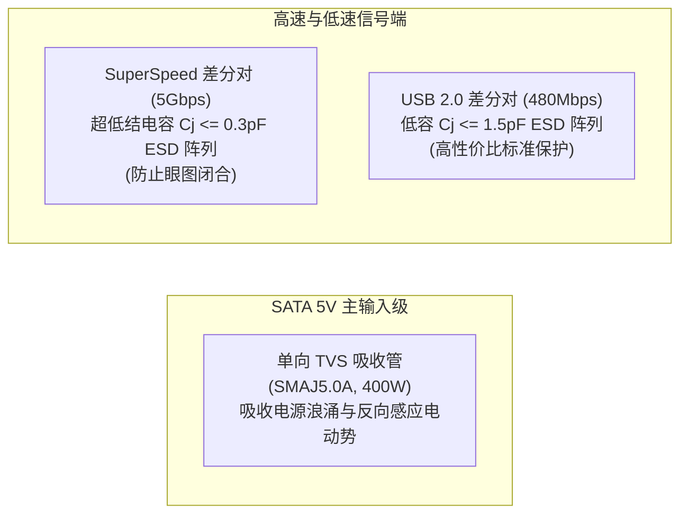

# USB 3.0 19Pin 一进四满定义扩展板 芯片与关键器件选型说明书

## 1. 文档概述与选型原则

### 1.1 文档目的
本文档为 **USB 3.0 19Pin 一进四“满定义”扩展板** 的关键元器件选型说明书（Chip & Component Selection Specification）。
文档依据 [01_PRD.md](file:///c:/Users/leiyu/Desktop/Document/work/USB3.0/01_Product_Definition/01_PRD.md) 的产品定义与 [01_System_Architecture.md](file:///c:/Users/leiyu/Desktop/Document/work/USB3.0/02_System_Design/01_System_Architecture.md) 的系统架构规范，对核心 USB 3.0 Hub 控制器芯片、电源保护器件（PPTC 自恢复保险丝、TVS 瞬态抑制器、ESD 静电防护阵列）、时钟晶振、大电流连接器以及阻容感无源器件进行多维度横向对比、参数验算与最终型号锁定。

### 1.2 选型核心原则
1. **电气性能与信号完整性优先**：
   * USB 3.0 高速链路工作在 5Gbps（奈奎斯特频率 2.5GHz），ESD 抑制器件与走线元器件的寄生电容必须极低（$< 0.4\text{pF}$），确保高频眼图张开度与插损裕量；
   * 供电器件必须具备持续承载 $4.5\text{A} \sim 6.0\text{A}$ 大电流能力，且内阻极小以压低直流回路压降（IR Drop）。
2. **极高安全性与工业级可靠性**：
   * 在 PC 机箱内密闭且背线仓风道微弱的环境下，主控芯片与电源器件温升必须严格受控（$\Delta T \le 35^\circ\text{C}$）；
   * 保护器件必须具备确定性的熔断/恢复特性，确保短路故障可靠隔离，杜绝起火与主机断电。
3. **极致的 BOM 成本控制与点数精简**：
   * 优先选用高度集成内部电源转换（5V 转 3.3V/1.2V）的主控方案，精简外置电源 IC 与外围阻容；
   * 选用常规公摊封装（如 0402 阻容、1206 PPTC、QFN-64 主控），降低 SMT 贴片加工加工费与钢网开孔成本。
4. **成熟供应链与第二备选源 (Second Source)**：
   * 优先选取在立创商城（LCSC）、华强北现货市场及国内一二线分销商现货储备充沛、采购周期 $\le 2$ 周的成熟器件；
   * 关键器件锁定 Pin-to-Pin 兼容或功能平替方案，规避单一渠道断货风险。

---

## 2. USB 3.0 Hub 核心主控芯片选型对比与决策

### 2.1 主控芯片横向选型对比
在 1 进 4 满定义架构中，系统需要 2 颗 4 端口 USB 3.0 Hub 控制器并行工作。市场上主流的 4 口 USB 3.0/3.1 Gen 1 控制器主要有：创惟科技（Genesys Logic）**GL3510**、瑞昱半导体（Realtek）**RTS5411**、威盛电子（VIA Labs）**VL817**、以及早期经典的 **VL812**。

四款主控芯片的多维度综合评估如下表所示：

| 评估维度 | 创惟科技 GL3510 | 瑞昱 RTS5411 | 威盛 VL817 | 威盛 VL812 (老款) |
| :--- | :--- | :--- | :--- | :--- |
| **封装形式** | **QFN-64 (8×8 mm)** / QFN-76 | QFN-76 (9×9 mm) | QFN-76 (9×9 mm) | QFN-88 (10×10 mm) |
| **引脚间距** | **0.4 mm** | 0.4 mm | 0.4 mm | 0.4 mm |
| **上行/下行接口** | 1 × 5Gbps / 4 × 5Gbps | 1 × 5Gbps / 4 × 5Gbps | 1 × 5Gbps / 4 × 5Gbps | 1 × 5Gbps / 4 × 5Gbps |
| **内部电源架构** | **内置 5V$\to$3.3V LDO 内置 5V$\to$1.2V 降压转换器** | 内置 5V$\to$3.3V LDO 内置 DC-DC 降压 | 内置 5V$\to$3.3V LDO 内置 DC-DC 降压 | 需外置 3.3V/1.2V LDO (外围极其臃肿) |
| **芯片工作功耗 (4口满载)** | **约 0.65W ~ 0.85W** (低发热) | 约 0.70W ~ 0.90W | 约 0.75W ~ 0.95W | $> 1.4W$ (发热严重) |
| **GANG Mode 支持** | **原生硬件引脚直配** | 原生硬件引脚支持 | 需特定固件配置 | 需外置上拉电阻 |
| **USB 2.0 多事务翻译 (MTT)**| **支持 (双 MTT)** | 支持 (单/双 MTT) | 支持 (单/双 MTT) | 仅单 MTT |
| **批量采购单价 (RMB)** | **约 3.8 ~ 4.5 元** (极具优势) | 约 5.5 ~ 6.5 元 | 约 5.8 ~ 7.0 元 | 约 3.5 ~ 4.0 元 (停产边缘) |
| **立创/华强现货储备** | **海量现货，流通量极大** | 现货较多，价格波动大 | 现货一般，渠道相对单一 | 市场多为翻新翻带散料 |
| **Linux/Win/Mac 兼容性** | **免驱极佳，工业兼容性标杆** | 免驱良好 | 免驱良好 | 偶发 S3 睡眠唤醒丢盘 |

### 2.2 最终主控选型结论与型号锁定
**【最终选定主控】：创惟科技（Genesys Logic）GL3510-QFN64**
* **选型理由**：
  1. **封装紧凑**：采用 QFN-64 (8×8 mm) 封装，比 RTS5411/VL817 的 76 引脚减少 12 个引脚，尺寸缩小约 20%，为 $62\text{mm} \times 38\text{mm}$ 紧凑板卡节省了极其宝贵的对称布线通道；
  2. **内置高效双电源**：GL3510 内部直接集成了 5V 到 3.3V 的高精度 LDO 以及 5V 到 1.2V 的开关型降压转换器（Switching Regulator），芯片仅需一颗小尺寸 2.2μH 贴片功率电感和少量去耦电容即可自主工作，单板彻底省去 2 颗独立外部电源降压 IC，降低 BOM 成本逾 2 元；
  3. **低发热与极高能效**：芯片采用先进制程，满载功耗仅约 0.7W，双芯片总功耗约 1.4W，依靠芯片底部大面积散热焊盘（Exposed Pad）与 Layer 2 地平面过孔散热，温升 $\Delta T < 30^\circ\text{C}$，完全适应密闭背线仓；
  4. **成本与供货无敌**：GL3510 是目前 PC DIY 外设、扩展坞及机箱 HUB 领域出货量最大的 USB 3.0 主控之一，单颗批量成本稳定在 4 元左右，货源极其充沛。
* **锁定采购订货料号 (MPN)**：
  * **主选型号**：`GL3510-OGY04` 或 `GL3510-OGY05`（QFN-64，Tape & Reel 编带包装，无铅环保 RoHs）。

---

## 3. 电源与多级保护器件选型规范

### 3.1 自恢复保险丝 (PPTC) 深度选型
根据系统架构，4 组输出 19Pin 插座（各承载 2 个逻辑端口）分别配置 1 颗自恢复保险丝进行独立支路过流/短路隔离保护。

#### 1. 电气参数选型计算
* **维持电流 ($I_{hold}$)**：
  * 单个 19Pin 插座承载 2 个 USB 3.0 端口。按 USB 3.0 规范单口额定 $0.9\text{A}$，双口并发额定电流为 $2 \times 0.9\text{A} = 1.8\text{A}$；
  * 考虑到机箱内部环境温度可能上升至 $45^\circ\text{C} \sim 50^\circ\text{C}$（PPTC 存在温度折减效应，高温下 $I_{hold}$ 会降低约 15%~20%），在 25°C 常温下的额定维持电流应选取：
    $$I_{hold} \ge \frac{1.8\text{A}}{1 - 0.20} = 2.25\text{A}$$
    因此，$I_{hold}$ 标准档位确定在 **$2.0\text{A} \sim 2.6\text{A}$**。
* **触发跳断电流 ($I_{trip}$)**：
  * 行业标准通常为 $I_{trip} \approx 1.8 \sim 2.0 \times I_{hold}$，对应约 **$4.0\text{A} \sim 5.0\text{A}$**。当支路发生严重过载或金属性短路碰地时，电流迅速超过 4A，PPTC 快速跳变至高阻态。
* **冷态内阻 ($R_{min} / R_{max}$)**：
  * 为了减小回路直流压降，PPTC 导通内阻必须极低。在 1.8A 满载电流下，若内阻为 $0.03\Omega$，产生的压降仅为 $\Delta V = 1.8\text{A} \times 0.03\Omega = 54\text{mV}$，完全在可控范围内。

#### 2. 封装与型号对比表

| 封装规格 | 代表型号 (以 WAYON 维安为例) | $I_{hold}$ (25℃) | $I_{trip}$ (25℃) | 最大耐压 $V_{max}$ | 最大耐流 $I_{max}$ | 典型冷态内阻 $R_{typ}$ | 选型结论与理由 |
| :---: | :--- | :---: | :---: | :---: | :---: | :---: | :--- |
| **1206** | **LP-MSM260** | **2.60 A** | **5.00 A** | **6.0 V** | **50 A** | **0.015 ~ 0.040 Ω** | **【推荐选用】**：占板面积极小（3.2×1.6mm），内阻超低，高温折减后仍可提供 2.1A 持续供电。 |
| **1206** | **LP-MSM200** | 2.00 A | 4.00 A | 8.0 V | 40 A | 0.020 ~ 0.055 Ω | **【备选型号】**：保护门限稍低，适合对电流保护更严苛的环境。 |
| **1812** | LP-SM260C | 2.60 A | 5.00 A | 6.0 V | 40 A | 0.015 ~ 0.035 Ω | 占板面积偏大（4.5×3.2mm），在紧凑四向出线布局中严重挤占高频线走廊，首版不采纳。 |

* **最终锁定物料**：
  * **第一选型 (主供)**：维安 (WAYON) **`LP-MSM260`**（1206 贴片封装，$I_{hold}=2.6\text{A}, V_{max}=6\text{V}$，立创现货，单价约 0.15~0.22 元）；
  * **第二选型 (备选)**：陆宝 / 聚鼎 (PTTC) **`SMD1206P260SLR`** 或 Littelfuse **`1206L260WR`**。

---

### 3.2 瞬态浪涌与 ESD 静电防护器件选型

由于 PC 机箱前置面板长线束属于典型的人体接触放电和金属工具盲插区域，极易受到 ESD 静电（高达 $\pm 8\text{kV} \sim \pm 15\text{kV}$）和电源热插拔浪涌的侵袭，系统在输入端与各输出端口部署严密的两级防护。

#### 1. SATA 5V 主输入浪涌保护 (TVS)
* **需求场景**：PC 开机上电或 SATA 接口带电热插拔时，长导线寄生电感会引发瞬态感应过冲电压（可能突破 7V~9V），需在 SATA 5V 入口处并联大功率 TVS 进行瞬间硬钳位。
* **选型参数**：
  * 反向关断电压 $V_{RWM} = 5.0\text{V}$（保证 5V 正常供电时不漏电）；
  * 击穿电压 $V_{BR} = 6.4\text{V} \sim 7.25\text{V}$；
  * 最大钳位电压 $V_C \le 9.2\text{V} @ I_{PP}=43.5\text{A}$；
  * 峰值脉冲功率 $P_{PPM} = 400\text{W}$。
* **锁定物料**：
  * **型号**：**`SMAJ5.0A`**（SMA / DO-214AC 贴片封装，单向 TVS，立创常见品牌如长捷、强茂、台半，单价约 0.12~0.18 元）。

#### 2. USB 3.0 SuperSpeed (5Gbps) 专用超低容 ESD 防护阵列
* **核心物理瓶颈**：SuperSpeed 信号基频高达 2.5GHz，ESD 器件的引脚寄生电容（$C_j$）相当于在高速差分线上并联了高频对地滤波电容。若 $C_j > 0.5\text{pF}$，将严重造成高速差分眼图垂直张开度闭合、抖动超标并引起 PCIe/USB3 控制器严重降速或丢包。
* **选型标准**：必须满足 **$C_j \le 0.35\text{pF}$（推荐 $\le 0.25\text{pF}$）**，且封装要求便于差分线直通无折弯布线（Flow-Through 封装）。
* **横向对比与选型决策**：

| 型号 | 厂商 | 封装通道 | 典型结电容 $C_j$ | 钳位电压 (TLP) | 差分走线拓扑支持 | 单价 (RMB) | 选型结论 |
| :--- | :---: | :---: | :---: | :---: | :---: | :---: | :--- |
| **AZ1045-04F** | 晶焱 (Amazing) | DFN-10P (4通道) | **0.25 pF** | 8.5V @ 4A | Flow-Through (直接穿通走线) | 0.45 ~ 0.60 | **【第一选型 (最优)】** 专为 USB3.0/HDMI 高速设计，眼图裕量极大。 |
| **ESD7383** | 安森美 (onsemi) / 国产替代 | DFN-10P (4通道) | 0.30 pF | 9.0V @ 4A | Flow-Through | 0.50 ~ 0.70 | **【第二选型】** 兼容 DFN-10 封装。 |
| **USBLC6-2SC6** | ST / 国产平替 | SOT-23-6 (2通道) | 3.5 pF | 11V | 传统弯折引线 | 0.15 ~ 0.25 | **【坚决禁用】** 结电容高达 3.5pF，会导致 5Gbps 信号彻底断流，仅适用于 USB 2.0。 |

* **部署数量与规划**：
  * 每个 19Pin 包含 2 组 SuperSpeed 差分接收对（SSRX1±, SSRX2±）和 2 组发送对（SSTX1±, SSTX2±），共 8 根高速线；
  * 输入 1 组 + 输出 4 组 = 共 5 组 19Pin。为平衡极佳的信号保护与 BOM 成本，在 4 组输出 19Pin 和 1 组输入 19Pin 的 SuperSpeed 引脚处，每组插座配置 2 颗 **`AZ1045-04F`**（每颗保护 2 对差分线，全板共 10 颗 DFN-10P 器件）。

#### 3. USB 2.0 差分对 (D+/D-) ESD 保护
* **选型标准**：USB 2.0 速率为 480Mbps，容许结电容 $C_j \le 1.5\text{pF} \sim 2.0\text{pF}$。
* **锁定物料**：选用高性价比双通道 SOT-23-6 封装超低容 ESD 芯片 **`SR05`** 或 **`USBLC6-2SC6`**（国产长电/微盟平替，结电容约 $1.0\text{pF}$，单价约 0.10~0.15 元）。

---

## 4. 时钟源（无源晶振）选型与匹配分析

### 4.1 晶体电气规格锁定
两颗 GL3510 分别需要独立的 24.000 MHz 工业级无源晶振提供参考时钟。

* **中心频率**：$24.000\text{ MHz} \pm 10\text{ppm}$（SuperSpeed 规范要求系统频偏绝对值 $\le \pm 50\text{ppm}$，选用 $\pm 10\text{ppm}$ 留足温度老化裕量）；
* **负载电容 ($C_L$)**：$12.0\text{ pF}$（主流标准规格）；
* **等效串联电阻 (ESR)**：$\le 30\Omega \sim 40\Omega$（低 ESR 保证内部反相器轻松起振，不起振裕量 $> 5$）；
* **工作温度范围**：$-20^\circ\text{C} \sim +70^\circ\text{C}$（商用级/工业拓展级）；
* **物理封装**：**SMD-3225 (3.2 mm × 2.5 mm, 4-Pin 贴片封装)**。3225 封装相比更小的 2016 封装焊接良率更高、ESR 更低且价格极低。

### 4.2 外部负载电容匹配公式推导与取值
晶振引脚所接的外部匹配电容 $C_1, C_2$ 需根据下列标准公式计算：
$$C_L = \frac{C_1 \times C_2}{C_1 + C_2} + C_{stray}$$
* 已知晶振额定负载电容 $C_L = 12\text{pF}$；
* PCB 走线与 GL3510 引脚的寄生杂散电容估算为 $C_{stray} \approx 3.0\text{pF} \sim 4.0\text{pF}$；
* 令对称电容 $C_1 = C_2 = C_{ext}$，代入公式：
  $$12\text{pF} = \frac{C_{ext}}{2} + 3.5\text{pF} \implies C_{ext} = 2 \times (12 - 3.5) = 17\text{pF}$$
* **设计取值**：在 $C_1$ 与 $C_2$ 位置选用标准标称容值 **$18\text{pF}$（0402 封装，C0G/NPO 高频高稳定材质，耐压 50V，公差 $\pm 5\%$）**。
* **锁定物料**：
  * **主供料号**：扬兴科技 (YXC) **`X322524MOB4SI`**（24.000MHz / 3225 4P / 12pF / ±10ppm，单价约 0.35~0.45 元）；
  * **备选料号**：TXC **`7M-24.000MAAJ-T`** 或 爱普生 (EPSON) **`FA-238 24.000000MHz`**。

---

## 5. 电源转换与储能/滤波无源器件选型

### 5.1 GL3510 内部 1.2V 降压专用功率电感
GL3510 内置高频开关降压转换器生成核心逻辑所需的 1.2V。该开关转换器需外挂一颗小型功率储能电感。
* **电感值要求**：**$2.2\mu\text{H} \pm 20\%$**；
* **额定饱和电流 ($I_{sat}$)**：$\ge 0.8\text{A} \sim 1.0\text{A}$（芯片 1.2V 核心功耗约 $150\text{mA} \sim 200\text{mA}$，1A 电感具备 5 倍安全裕量）；
* **直流阻抗 (DCR)**：$\le 150\text{m}\Omega$（降低电感自身发热）；
* **封装形式**：**贴片 0806 / 2520 封装一体成型功率电感**（2.5 mm × 2.0 mm × 1.2 mm）；
* **锁定物料**：
  * **型号**：顺络电子 (Sunlord) **`MPHM252012S2R2MT`** 或 顺络 **`WPN252010H2R2MT`**（2.2μH, 1.2A, DCR=120mΩ，单价约 0.20~0.28 元）。全板共需 2 颗。

### 5.2 大容量储能与高频滤波电容阵列

为了消除机箱内 8 盘并发插入瞬间的瞬态跌落（Droop），整板构建分级阶梯去耦储能网络：

| 部署位置 | 推荐电容类型与规格 | 封装与参数 | 数量 | 核心工程功能 |
| :--- | :--- | :--- | :---: | :--- |
| **SATA 5V 主输入入口** | 贴片固态高分子聚合物电容 / 钽电容 | **$100\mu\text{F} \sim 220\mu\text{F}$ / 6.3V~10V** Case-B (3528) 或 1210 MLCC | 1 颗 | 充当板级“蓄水池”，在下游多外设热插拔瞬间释放电荷，抑制 5V 电压骤降。 |
| **SATA 5V 输入高频旁路** | 贴片陶瓷多层电容 (MLCC) | **$10\mu\text{F}$ / 10V X5R** (0805) + **$0.1\mu\text{F}$ / 16V X7R** (0402) | 各 1 颗 | 滤除 PC 电源线长引线引入的高频开关纹波。 |
| **每组 19Pin 输出端口 (×4组)** | 贴片陶瓷多层电容 (MLCC) | **$10\mu\text{F}$ / 10V X5R** (0805) + **$0.1\mu\text{F}$ / 16V X7R** (0402) | 共 4 组 | 满足 USB 规范单端口下行挂接 $\ge 120\mu\text{F}$ 的等效池约束（由板端 10μF + 前置面板本地电容协同承载）。 |
| **GL3510 芯片电源引脚 (×2套)** | 贴片陶瓷去耦电容 (MLCC) | **$4.7\mu\text{F}$ / 10V** (0603) + **$0.1\mu\text{F}$ / 16V X7R** (0402) | 各 6~8 颗 | 紧靠芯片 `VDD33`、`VDD12`、`AVDD` 引脚放置，滤除芯片内部时钟开关噪声。 |

---

## 6. 关键连接器与结构件选型说明

### 6.1 SATA 15Pin 供电公座选型
* **接口属性**：板载标准 SATA 15Pin 供电插座（公头，带定位柱，插接 PC 电源母头）；
* **引脚耐流要求**：
  * SATA 规范规定单引脚额定电流为 $1.5\text{A}$；
  * 本板仅接通 Pin 4、5、6（+5V）和 Pin 7、8、9、10、11、12（GND）；
  * 3 针并联承流能力可达：$3 \times 1.5\text{A} = 4.5\text{A}$（短时冲击可达 $6.0\text{A}$）；
* **安装形式与焊接牢固度**：
  * **选型决定**：选用 **直焊侧插式（Right-Angle SMD + 鱼叉脚定位通孔插针）**。PC 电源线通常材质粗硬，拔插应力极大，带有直插焊盘或固定鱼叉脚的座子抗剥离扭矩 $> 50\text{N}$，彻底避免使用中扯裂 PCB 铜皮；
* **推荐供应商料号**：精锐 / 创联 **`SATA-15P-M-SMT-RA`**（立创商城料号常见，单价约 0.65~0.95 元）。

### 6.2 19Pin 输入母座 (J_IN) 选型
* **接口属性**：标准 2×10Pin 间距 2.00mm 简易牛角/排母插座（Pin 20 拔针防呆，配塑料外框导向防反插）；
* **形态决策**：
  * 选用 **直插式（Vertical Straight Female）** 或 **卧式侧插（Right-Angle Female）**；
  * 为便于机箱底部主板连线顺畅接入，首版推荐选用 **直插母座（Vertical 180°）带卡扣外框**，引脚采用双排通孔插针（Through-Hole），机械固定强度高；
* **接触阻抗与镀金层**：
  * 引脚磷铜镀金 $\ge 1\mu''$（抗氧化、多次插拔接触电阻 $\le 20\text{m}\Omega$），额定电流 $1.5\text{A/Pin}$；
* **参考料号**：灿科盟 (CKMTW) / 康瑞 **`USB3.0-19P-F-180`**（单价约 1.20~1.80 元）。

### 6.3 4 组 19Pin 输出公座 (J_OUT1 ~ J_OUT4) 选型
* **接口属性**：标准 2×10Pin 间距 2.00mm 双排弯针插座（带缺口防呆塑料外框胶壳）；
* **防干涉与出线方向决策**：
  * 4 组公座布置在长边两翼。为使插拔线缆沿机箱底板水平延展，坚决选用 **卧式侧插弯针（Right-Angle 90° Male Header with Box）**；
  * 胶壳尺寸：长约 $24.0\text{mm} \times$ 宽约 $8.5\text{mm}$；两个插座中心距锁定为 $30.0\text{mm}$，保留 $6.0\text{mm}$ 物理净空，完美兼容任意品牌加厚注塑前置插头；
* **参考料号**：欧时 / 优联康 **`USB3-19P-M-90-RA`**（单价约 0.90~1.30 元）。

---

## 7. 元器件选型汇总与第二备选源 (BOM Matrix)

为确保项目顺利进入批量投产，全板核心元器件物料矩阵及第二备选源规划如下：

| 元件类别 | 原理图位号 (RefDes) | 推荐第一型号 (Primary MPN) | 品牌 / 产地 | 封装规格 | 第二备选型号 (Second Source) | 采购渠道 |
| :--- | :--- | :--- | :---: | :---: | :--- | :---: |
| **USB 3.0 Hub 控制器** | U1, U2 | **GL3510-OGY04** | 创惟 (Genesys Logic) | QFN-64 (8×8) | GL3510-OGY05 / GL3523 (Pin兼容需核对) | 代理商 / 立创 |
| **自恢复保险丝 (PPTC)** | F1, F2, F3, F4 | **LP-MSM260** (2.6A) | 维安 (WAYON) | 1206 | PTTC SMD1206P260SLR / Littelfuse 1206L260 | 立创 / 华强 |
| **超低容 ESD 阵列** | D1 ~ D10 | **AZ1045-04F** (0.25pF) | 晶焱 (Amazing) | DFN-10P | onsemi ESD7383 / 硕凯 ESD0324LB | 立创 / 艾睿 |
| **主输入 TVS 管** | D11 | **SMAJ5.0A** (400W) | 强茂 / 长捷 | SMA (DO-214AC) | SMBJ5.0A / WS05M | 立创商城 |
| **24MHz 无源晶振** | Y1, Y2 | **X322524MOB4SI** (12pF) | 扬兴 (YXC) | SMD-3225 4P | TXC 7M-24.000MAAJ-T / 爱普生 FA-238 | 立创 / 扬兴 |
| **2.2μH 功率电感** | L1, L2 | **MPHM252012S2R2MT** (1.2A) | 顺络 (Sunlord) | SMD-2520 (0806) | 风华高科 PI252010-2R2M | 立创商城 |
| **主滤波固态电容** | C1 | **100μF 10V 钽电容/高分子** | AVX / 湘怡 / 国产 | Case-B (3528) | 220μF 6.3V 贴片铝固态 / 47μF 1210 MLCC x2 | 立创商城 |
| **SATA 15Pin 公座** | J_PWR | **SATA-15P-M-SMT-RA** | 精锐 / 创联 | 15Pin 弯插带定位 | 富士康 / 得润兼容件 | 立创商城 |
| **19Pin 直插母座** | J_IN | **USB3.0-19P-F-180** | 灿科盟 / 康瑞 | 2×10P 2.0mm 直插 | 欧时兼容件 | 立创商城 |
| **19Pin 弯针公座** | J_OUT1 ~ 4 | **USB3-19P-M-90-RA** | 欧时 / 优联康 | 2×10P 2.0mm 弯针 | 灿科盟 / 康瑞兼容件 | 立创商城 |
| **AC 耦合电容** | C_AC1 ~ 20 | **0.1μF 10V X7R ±10%** | 国巨 / 村田 / 潮州三环 | 0402 贴片 | 风华高科 0402B104K160CT | 通用料 |

---

## 8. 下一步接口指引

本芯片与器件选型说明书锁定了全板元件的物理封装、电气额定值与引脚特性：
* **电源与防倒灌详细计算** $\rightarrow$ 请查阅 [03_Power_Design.md](file:///c:/Users/leiyu/Desktop/Document/work/USB3.0/02_System_Design/03_Power_Design.md)：基于上述选定的 `LP-MSM260` PPTC 内阻（$0.02\Omega$）、SATA 15Pin 导线内阻与铜箔厚度，展开闭环直流压降推导与温升计算；
* **成本核算表对接** $\rightarrow$ 请查阅 `04_Cost_Analysis.xlsx`：直接调用本文档第 7 章节的物料矩阵与推荐料号，进行多批量梯度采购成本核算。
